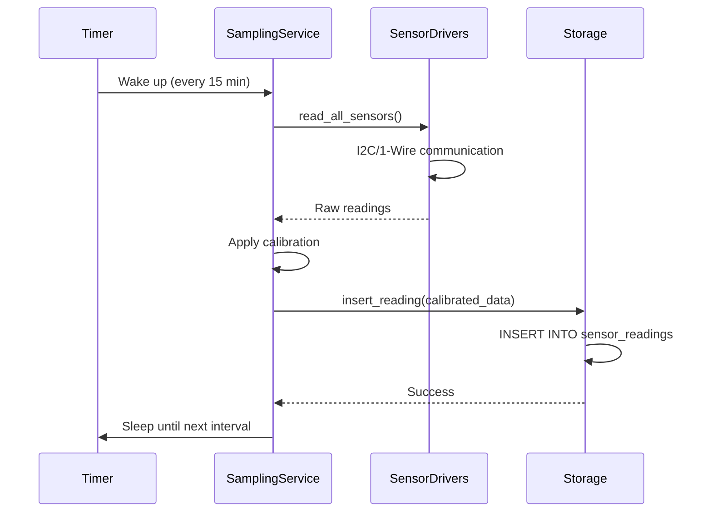
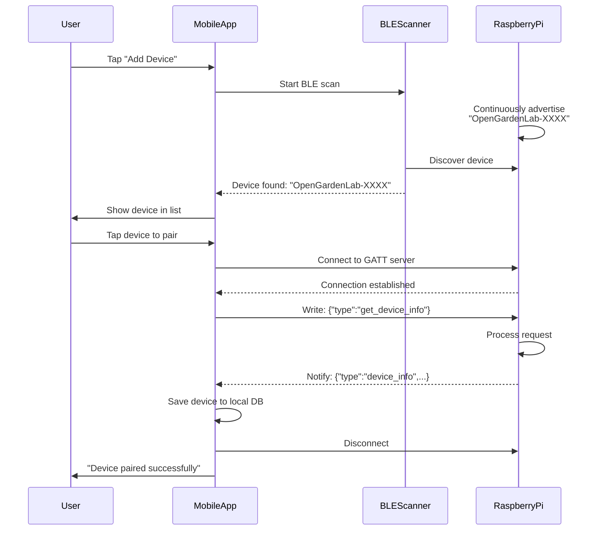
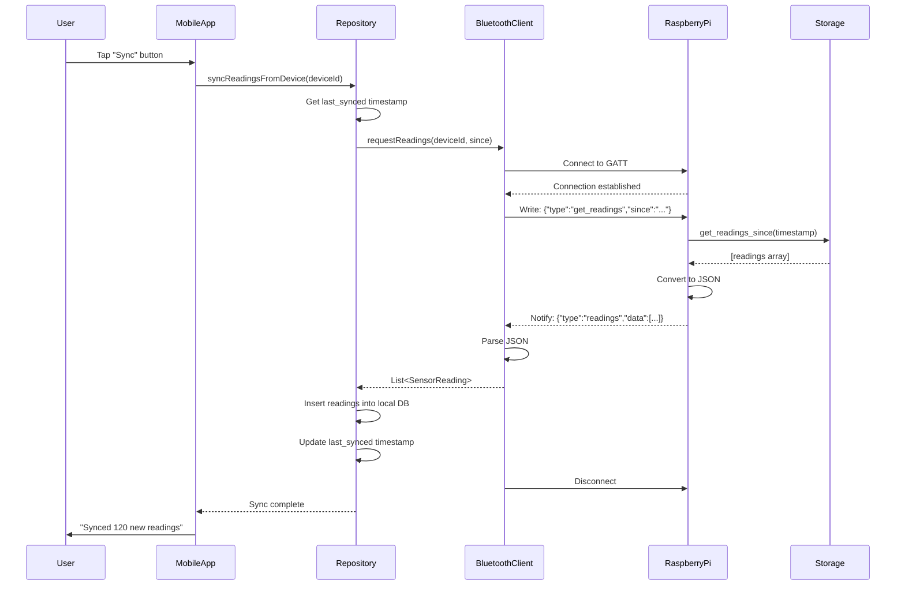
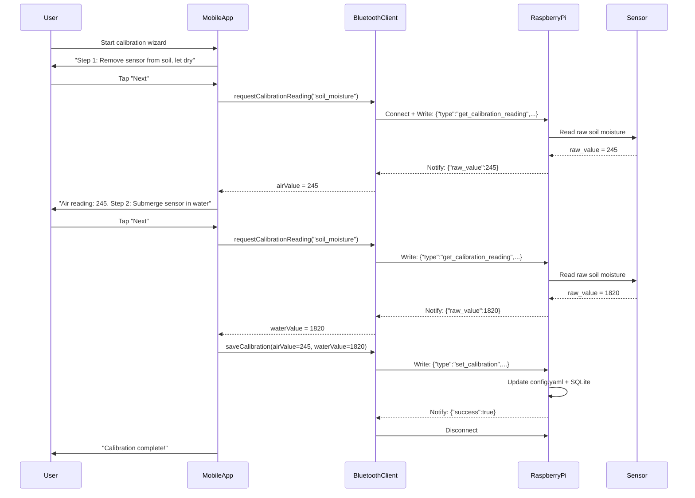

# OpenGardenLab IoT System Architecture

**Project:** OpenGardenLab IoT Garden Monitoring System
**Architect:** Winston
**Version:** 1.0
**Date:** 2025-10-02
**Status:** Draft

---

## Change Log

| Date | Version | Description | Author |
|------|---------|-------------|--------|
| 2025-10-02 | 1.0 | Initial architecture document | Architect (Winston) |

---

## Introduction

This document defines the complete system architecture for **OpenGardenLab**, an IoT garden monitoring system that combines hardware sensors, embedded firmware, and a mobile application to help home gardeners make data-driven decisions about plant care.

Unlike traditional web application architectures, OpenGardenLab is a **hardware/software hybrid system** with unique architectural considerations:

- **Embedded hardware** running autonomously in outdoor environments
- **Local-first data architecture** with no cloud dependency
- **Bluetooth Low Energy** communication instead of HTTP/REST
- **Power management** for battery-operated devices
- **Environmental durability** (weatherproofing, temperature extremes)

This architecture is informed by:
- [Project Brief](project-brief.md) - Initial vision and goals
- [PRD](prd.md) - 30 user stories across 4 epics
- [Technical Feasibility Research](technical-feasibility.md) - Hardware platform selection
- [Sensor Selection Research](sensor-selection.md) - I2C sensor specifications
- [Plant Database Research](plant-database-research.md) - Data curation strategy

### Architecture Type

**Greenfield IoT System** - No existing codebase or starter templates. Custom-designed for educational IoT development with open-source distribution.

---

## High-Level Architecture

### Technical Summary

OpenGardenLab is a **distributed embedded system** consisting of three major components:

1. **Raspberry Pi Zero 2 W firmware** (Python) - Autonomous sensor data collection and local storage, operating continuously in garden environments with weekly power bank swaps.

2. **Android mobile app** (Kotlin) - Offline-capable interface for viewing sensor data, receiving plant care recommendations, and managing multiple garden zones.

3. **Bluetooth Low Energy (BLE) communication** - On-demand sync protocol allowing mobile app to retrieve sensor data when user is within range (~30-100 feet), eliminating need for WiFi infrastructure or cloud services.

The system uses a **local-first, offline-first architecture** where each component operates independently: firmware samples sensors every 15-60 minutes regardless of app connectivity, app displays cached data and recommendations without internet, and data synchronization occurs opportunistically via Bluetooth when devices are in proximity.

This architecture achieves PRD goals by:
- **Providing actionable recommendations** through local comparison of sensor readings vs plant-specific optimal ranges
- **Enabling learning** through accessible Python firmware and well-documented Android development
- **Supporting future expansion** with modular sensor interfaces and extensible mobile app architecture
- **Maintaining data ownership** by storing all sensor data locally on device and in mobile app (no cloud lock-in)

### Platform and Infrastructure

**Platform:** Hybrid embedded/mobile (no traditional cloud infrastructure)

**Key Components:**
- **Edge Device:** Raspberry Pi Zero 2 W (ARM Cortex-A53, 512MB RAM)
- **Mobile Platform:** Android 8.0+ (API 26)
- **Communication:** Bluetooth Low Energy 4.2+
- **Storage:** Local SQLite databases (device + mobile app)
- **Power:** Swappable USB power banks (MVP), solar charging (post-MVP)

**No cloud services required for MVP.** The system is designed to operate entirely offline:
- No authentication servers (single-user app, device pairing only)
- No remote data storage (all data local)
- No API gateways or load balancers
- No CDN or caching layers

**Deployment "Regions":** User's home garden (typically 1-3 devices per household)

**Rationale:** This architecture prioritizes **data ownership, privacy, and independence** over convenience features like remote access. It also significantly reduces operating costs (no monthly cloud fees) and complexity (no API management, no distributed system debugging). The local-first approach aligns with the learning goals of understanding fundamental IoT patterns before adding cloud abstractions.

---

## Hardware Architecture

### Component Overview

The OpenGardenLab device consists of:

**Compute Platform:**
- **Raspberry Pi Zero 2 W** - BCM2710A1 SoC (4× ARM Cortex-A53 @ 1GHz), 512MB RAM
- **MicroSD Card** - 16-32GB (high-endurance class for frequent writes)
- **Operating System** - Raspberry Pi OS Lite 64-bit (Debian-based, headless)

**Sensors (all I2C or 1-Wire digital):**
- **Adafruit STEMMA Soil Sensor (4026)** - I2C capacitive moisture + soil temp
- **Adafruit BH1750 (4681)** - I2C light sensor (1-65,535 lux)
- **Adafruit DHT20/AHT20 (5183)** - I2C air temp + humidity
- **DS18B20 Waterproof Probe** - 1-Wire soil temperature (optional, more accurate than STEMMA)

**Power:**
- **2× USB Power Banks** (10,000-20,000mAh) - Swappable weekly (charge one while using one)
- **USB-to-MicroUSB cable** for Pi power

**Enclosure:**
- **IP65 waterproof box** (12-20cm) with clear acrylic window for light sensor
- **Cable glands** for sensor wires exiting enclosure

**Connectivity:**
- **WiFi 802.11n** (2.4GHz) - Used only for SSH development access, disabled in production
- **Bluetooth 4.2 BLE** - Primary communication with mobile app

---

### Sensor Wiring Diagram

All sensors connect to Raspberry Pi GPIO header via **I2C bus (SDA, SCL) and 1-Wire (GPIO4)**:

```
Raspberry Pi Zero 2 W GPIO Header
┌─────────────────────────────────┐
│  Pin 1 (3.3V) ────┬──────┬──────┼─── All sensor VCC
│  Pin 3 (SDA)  ────┼──┬───┼──────┼─── I2C Data (STEMMA, BH1750, DHT20)
│  Pin 5 (SCL)  ────┼──┼───┼──────┼─── I2C Clock (STEMMA, BH1750, DHT20)
│  Pin 6 (GND)  ────┴──┴───┴──────┼─── All sensor GND
│  Pin 7 (GPIO4) ───────────────────── DS18B20 Data (1-Wire) + 4.7kΩ pullup to 3.3V
└─────────────────────────────────┘

Sensors:
1. Adafruit STEMMA Soil (I2C 0x36): VCC, GND, SDA, SCL
2. Adafruit BH1750 Light (I2C 0x23): VCC, GND, SDA, SCL
3. Adafruit DHT20 (I2C 0x38): VCC, GND, SDA, SCL
4. DS18B20 Soil Temp (1-Wire): VCC, GND, Data (GPIO4), 4.7kΩ pullup
```

**Advantages of all-digital sensor architecture:**
- No ADC required (simplifies wiring, reduces component count)
- All I2C sensors share 2 wires (SDA, SCL) - easy to add more sensors
- Digital readings are more accurate and stable than analog
- Well-supported Python libraries (Adafruit CircuitPython)

**I2C Address Map:**
- `0x36` - STEMMA Soil Sensor
- `0x23` - BH1750 Light Sensor
- `0x38` - DHT20 Temp/Humidity Sensor

No address conflicts. If additional I2C sensors are added post-MVP, addresses can be checked with `i2cdetect -y 1`.

---

### Physical Deployment Architecture

**Enclosure Design:**

```
┌─────────────────────────────────────┐
│  IP65 Waterproof Enclosure          │
│                                     │
│  ┌────────────┐    ┌─────────────┐ │
│  │ Raspberry  │    │  USB Power  │ │
│  │ Pi Zero 2W │◄───┤  Bank       │ │
│  │            │    │ 20,000mAh   │ │
│  └────────────┘    └─────────────┘ │
│                                     │
│  [Clear Acrylic Window]             │  ← BH1750 light sensor inside
│     (for light sensor)              │
│                                     │
│  Cable Glands ↓↓↓                   │
└──────────────│││────────────────────┘
               │││
      ┌────────┘││
      │   ┌─────┘│
      │   │   ┌──┘
      ▼   ▼   ▼
   [Soil] [Soil] [Air]
   Moisture Temp  Temp/Humid
   (STEMMA)(DS18B20)(DHT20)
```

**Sensor Placement Best Practices:**

1. **Soil Moisture Sensor (STEMMA):**
   - Depth: 2-4 inches (5-10cm) in root zone
   - Location: Midway between plant stem and edge of root zone
   - Installation: Insert at 45° angle, full probe depth in soil

2. **Light Sensor (BH1750):**
   - Location: Inside enclosure behind clear acrylic window
   - Height: 6-12 inches above soil (or at plant canopy height)
   - Orientation: Window facing upward (measures ambient light)

3. **Air Temp/Humidity (DHT20):**
   - Location: Inside enclosure (ventilated, shaded)
   - Height: 4-6 inches above soil
   - Note: Enclosure must allow airflow (vent holes with mesh to keep bugs out)

4. **Soil Temp Probe (DS18B20):**
   - Depth: 2-4 inches (same depth as moisture sensor)
   - Location: Near moisture sensor for correlated readings
   - Installation: Insert probe horizontally into soil (long cable allows enclosure to be above ground)

**Power Management:**
- Pi Zero 2 W consumes ~100-150mA idle, ~400mA peak (sensor reads + Bluetooth)
- 20,000mAh power bank = ~133 hours = 5.5 days at 150mA average
- **Target: 7+ days** requires optimizations (disable WiFi, reduce sampling frequency)
- User swaps power bank weekly, charges drained one

---

### Bill of Materials (BOM)

| **Component** | **Model/Specs** | **Qty** | **Unit Cost** | **Total** |
|---------------|-----------------|---------|---------------|-----------|
| Raspberry Pi Zero 2 W | BCM2710A1, 512MB RAM | 1 | $18 | $18 |
| MicroSD Card | 16-32GB high-endurance | 1 | $10 | $10 |
| STEMMA Soil Sensor | Adafruit 4026 | 1 | $7 | $7 |
| BH1750 Light Sensor | Adafruit 4681 | 1 | $6 | $6 |
| DHT20 Temp/Humidity | Adafruit 5183 | 1 | $6 | $6 |
| DS18B20 Soil Temp Probe | Waterproof | 1 | $10 | $10 |
| USB Power Banks (2×) | 10,000-20,000mAh | 2 | $20 | $40 |
| IP65 Enclosure | 12-20cm waterproof box | 1 | $15 | $15 |
| STEMMA QT Cables | I2C interconnect | 2 | $2 | $4 |
| 4.7kΩ Resistor | Pullup for 1-Wire | 1 | $0.10 | $0.10 |
| Misc | Jumper wires, USB cables | - | $5 | $5 |
| **TOTAL PER DEVICE** | | | | **$121** |

**Within budget:** PRD target was $150/device. Actual ~$121 leaves $29 margin for enclosure upgrades or additional sensors.

---

**Phase 1 Complete.** This section established the foundation: introduction, platform choice, and complete hardware architecture with wiring, deployment, and BOM.

---

## Tech Stack

This table is the **definitive technology selection** for OpenGardenLab. All development must use these exact versions and tools.

| **Category** | **Technology** | **Version** | **Purpose** | **Rationale** |
|--------------|----------------|-------------|-------------|---------------|
| **Firmware Language** | Python | 3.9+ | Raspberry Pi firmware development | Accessible from .NET background, rich IoT libraries (Adafruit CircuitPython), rapid prototyping, excellent debugging via SSH |
| **GPIO Library** | Adafruit CircuitPython | Latest | I2C/1-Wire sensor communication | Well-documented, beginner-friendly, official Adafruit support for all chosen sensors |
| **Bluetooth Library** | bleak | 0.21+ | BLE server on Raspberry Pi | Async Python BLE library, cross-platform, actively maintained, simpler than bluepy |
| **Firmware Database** | SQLite | 3.x (built-in) | Local sensor data storage | Built-in to Python, lightweight, no server needed, perfect for embedded use |
| **Firmware Config** | PyYAML | 6.0+ | Read/write device config files | Human-readable config (calibration, sampling interval), easy to edit via SSH |
| **Firmware Logging** | Python logging | 3.9+ (built-in) | Structured logging to file | Built-in, rotating file handler, SSH-accessible logs for debugging |
| **Mobile Platform** | Android | 8.0+ (API 26) | Mobile app platform | Developer has Android device, BLE APIs well-supported from API 26, large user base |
| **Mobile Language** | Kotlin | Latest | Android native mobile app development | Native Android performance, full BLE API access, mature ecosystem. Android-only (iOS not considered due to $99/year App Store requirement and no sideloading support) |
| **Mobile Database** | SQLite (Room) | Latest | Local sensor data cache | Mirrors firmware schema, offline-first architecture, well-integrated with Android |
| **Mobile Charts** | MPAndroidChart | Latest | Time-series sensor data visualization | Popular Android charting library, supports line charts with zoom/pan |
| **Plant Database Format** | YAML → JSON | N/A | Human-editable plant profiles | YAML for Git-friendly editing with citations, compiled to JSON for mobile app bundle |
| **Version Control** | Git + GitHub | Latest | Source code management | Industry standard, supports open-source distribution, GitHub Actions for CI/CD |
| **Firmware Testing** | pytest | 7.x+ | Unit tests for sensor logic | Standard Python testing framework, mocking support for I2C sensors |
| **Mobile Testing** | JUnit/Espresso | Latest | Unit + UI tests for mobile app | Standard Android testing framework (JUnit for unit tests, Espresso for UI tests) |
| **Build Tool (Firmware)** | systemd | N/A | Autostart firmware on Pi boot | Built-in to Raspberry Pi OS, reliable service management |
| **Build Tool (Mobile)** | Gradle | Latest | Android app build/package | Standard Android build system, integrates with Android Studio |
| **CI/CD** | GitHub Actions | N/A | Automated testing + build | Free for open-source, runs pytest for firmware, builds mobile app, validates plant YAML |
| **Monitoring (Firmware)** | Log files + SSH | N/A | Manual log inspection during development | Simple logging to `/home/pi/firmware/logs/`, tail via SSH for debugging |
| **Monitoring (Mobile)** | Logcat (development only) | N/A | Android debug logs during development | Standard Android logging, no production telemetry (privacy-first) |
| **Deployment (Firmware)** | Manual SD card flash + SSH config | N/A | Initial setup: flash Pi OS, copy firmware, enable systemd service | No OTA updates in MVP (future consideration) |
| **Deployment (Mobile)** | APK via GitHub Releases | N/A | Open-source APK distribution | Free APK download from GitHub releases, users sideload to Android devices. Post-MVP: F-Droid (open-source app store) or Google Play ($25 one-time) |

### Key Technology Decisions

**1. Python for Firmware (not C/C++)**
- **Pros:** Faster development, easier debugging, extensive library support, accessible to .NET developers
- **Cons:** Slightly higher power consumption than C/C++, slower execution
- **Decision:** MVP prioritizes learning and rapid iteration over maximum efficiency. Python's development speed and debugging capabilities outweigh performance concerns for 15-minute sampling intervals.

**2. Kotlin for Android Mobile App**

**Why Android-only:**
- **iOS distribution is impractical for open-source hardware projects:** Apple requires $99/year App Store fee with no free alternative (no sideloading). Android allows free APK distribution via GitHub Releases or F-Droid.
- **Target audience:** Home gardeners building IoT hardware are more likely Android users (tinkerer demographic).
- **Budget:** Zero ongoing costs for MVP (APK distribution is free).

**Why Kotlin:**
- **Native Android performance:** No cross-platform overhead, optimal performance
- **Full BLE API access:** Complete control over Bluetooth Low Energy communication
- **Mature ecosystem:** Industry standard for Android development, extensive libraries and tooling
- **Strong community support:** Large developer community, extensive documentation
- **Excellent tooling:** First-class support in Android Studio
- **Modern language features:** Coroutines for async operations, null safety, concise syntax

**Decision:** Use Kotlin for native Android development. No prototyping phase needed - Kotlin is the clear choice for Android-only IoT applications requiring Bluetooth LE.

**3. SQLite for All Storage (not PostgreSQL, MongoDB, etc.)**
- **Rationale:** Local-first architecture requires embedded database. SQLite is battle-tested, built-in to Python and Android, zero-configuration, perfect for single-device use. No need for client-server databases.

**4. Bluetooth Low Energy (not WiFi HTTP API)**
- **Rationale:** Eliminates need for home WiFi infrastructure, router configuration, or cloud backend. BLE works in gardens without WiFi coverage. Aligns with local-first, privacy-focused design.

**5. No Cloud Platform (not AWS, Azure, GCP)**
- **Rationale:** MVP focuses on fundamentals. Cloud adds complexity (auth, scaling, billing) that distracts from learning IoT basics. Post-MVP can add optional cloud sync for remote access.

**6. Android APK Distribution via GitHub Releases (not App Stores)**
- **Rationale:** Open-source hardware projects expect users to build/sideload. GitHub Releases provides free hosting for APK artifacts. Users enable "Install from Unknown Sources" on Android (standard for open-source apps). Post-MVP options: F-Droid (free, popular with FOSS community) or Google Play ($25 one-time if desired).

---

## Repository Structure

**Monorepo** - Single Git repository containing all OpenGardenLab components.

**Rationale:**
- Easier to keep firmware, mobile app, and plant database synchronized
- Atomic commits across components (e.g., Bluetooth protocol change + app update in one commit)
- Simpler for solo developer (one repo to clone, one CI/CD pipeline)
- Shared documentation in one place

**Structure:**

```
opengardenlab/
├── .github/
│   └── workflows/
│       ├── firmware-tests.yml        # pytest for Python firmware
│       ├── mobile-tests.yml          # Android unit tests
│       └── plant-db-validation.yml   # Validate YAML schema
├── firmware/                         # Raspberry Pi Python firmware
│   ├── src/
│   │   ├── sensor_service.py         # Main sampling loop
│   │   ├── sensors/                  # Sensor drivers
│   │   │   ├── stemma_soil.py
│   │   │   ├── bh1750_light.py
│   │   │   ├── dht20_temp_humid.py
│   │   │   └── ds18b20_temp.py
│   │   ├── storage.py                # SQLite data access layer
│   │   ├── bluetooth_server.py       # BLE server + protocol
│   │   └── config.py                 # YAML config loader
│   ├── data/                         # Runtime data directory
│   │   └── sensor_data.db            # SQLite database (created at runtime)
│   ├── logs/                         # Log files (created at runtime)
│   ├── tests/                        # pytest unit tests
│   │   ├── test_sensors.py
│   │   ├── test_storage.py
│   │   └── test_bluetooth.py
│   ├── config.yaml                   # Device configuration (calibration, sampling interval)
│   ├── requirements.txt              # Python dependencies
│   └── README.md                     # Firmware setup guide
├── mobile-app/                       # Android application
│   ├── app/                          # Main app module (Kotlin)
│   │   ├── src/
│   │   │   ├── main/
│   │   │   │   ├── java/com/opengardenlab/
│   │   │   │   │   ├── ui/          # UI screens (Dashboard, Charts, Settings)
│   │   │   │   │   ├── data/        # Local DB, repositories
│   │   │   │   │   ├── bluetooth/   # BLE client
│   │   │   │   │   ├── models/      # Data models
│   │   │   │   │   └── recommendations/ # Recommendation engine
│   │   │   │   ├── assets/          # plants.json bundled here
│   │   │   │   └── AndroidManifest.xml
│   │   │   └── test/                # Unit tests
│   │   ├── build.gradle
│   │   └── README.md
│   └── build.gradle (root)
├── plant-database/                   # YAML plant profiles
│   ├── schema/
│   │   └── plant-schema.yaml         # JSON schema for validation
│   ├── vegetables/
│   │   ├── tomato-cherry.yaml
│   │   ├── pepper-bell.yaml
│   │   └── ...
│   ├── herbs/
│   │   ├── basil.yaml
│   │   ├── cilantro.yaml
│   │   └── ...
│   ├── fruits/
│   │   ├── strawberry.yaml
│   │   └── ...
│   └── README.md                     # Plant data curation guide
├── scripts/
│   ├── compile-plants.py             # YAML → JSON compiler
│   └── validate-plants.sh            # CI validation script
├── docs/                             # All project documentation
│   ├── prd.md
│   ├── architecture.md               # This file
│   ├── project-brief.md
│   ├── technical-feasibility.md
│   ├── sensor-selection.md
│   ├── plant-database-research.md
│   ├── hardware-platform-research.md
│   ├── bluetooth-protocol.md         # To be created in Epic 3
│   └── workflow-plan.md
├── .gitignore
├── LICENSE                           # MIT or Apache 2.0
└── README.md                         # Project overview, quick start
```

**Package Management:**
- **Firmware:** `requirements.txt` for pip dependencies
- **Mobile:** Gradle (Kotlin)
- **No monorepo tool needed** - simple enough for manual coordination

---

## Data Models

### Core Entities

OpenGardenLab has 4 primary data entities shared between firmware and mobile app:

#### 1. SensorReading

**Purpose:** Timestamped snapshot of all sensor values from a single sampling cycle.

**Storage:** SQLite table in both firmware and mobile app (schema mirrored for sync)

**Attributes:**

| Attribute | Type | Description |
|-----------|------|-------------|
| `id` | INTEGER (PK) | Auto-increment primary key |
| `device_id` | TEXT | Device identifier (Pi MAC address or UUID) |
| `timestamp` | TEXT (ISO 8601) | Reading time (UTC): `2025-10-02T14:30:00Z` |
| `soil_moisture` | REAL | Calibrated soil moisture (0-100%) |
| `soil_temp_stemma` | REAL | Soil temperature from STEMMA sensor (°C) |
| `soil_temp_ds18b20` | REAL (nullable) | Soil temperature from DS18B20 probe (°C), if present |
| `light_lux` | REAL | Light intensity (0-65535 lux) |
| `air_temp` | REAL | Air temperature from DHT20 (°C) |
| `air_humidity` | REAL | Relative humidity from DHT20 (0-100%) |

**TypeScript/Kotlin Interface (for mobile app):**

```typescript
interface SensorReading {
  id: number;
  deviceId: string;
  timestamp: string; // ISO 8601
  soilMoisture: number;
  soilTempStemma: number;
  soilTempDs18b20: number | null;
  lightLux: number;
  airTemp: number;
  airHumidity: number;
}
```

**Relationships:**
- Belongs to one `Device`
- Foreign key: `device_id` → `devices.id`

---

#### 2. Plant

**Purpose:** Plant care profile with optimal environmental ranges.

**Storage:** YAML source files in `plant-database/`, compiled to JSON, bundled with mobile app

**Attributes:**

| Attribute | Type | Description |
|-----------|------|-------------|
| `id` | TEXT | Unique plant identifier (e.g., `tomato-cherry`) |
| `commonName` | TEXT | Display name (e.g., `Cherry Tomato`) |
| `scientificName` | TEXT | Botanical name (e.g., `Solanum lycopersicum var. cerasiforme`) |
| `category` | ENUM | `vegetable`, `herb`, or `fruit` |
| `soilMoisture` | Object | `{ min: number, max: number, notes: string }` |
| `light` | Object | `{ hoursPerDay: number, minLux: number, idealLux: number, notes: string }` |
| `airTemp` | Object | `{ minC: number, maxC: number, idealC: number, notes: string }` |
| `humidity` | Object (optional) | `{ min: number, max: number, notes: string }` |
| `sources` | Array | `[{ name: string, url: string }]` - Citations for data |

**TypeScript Interface:**

```typescript
interface Plant {
  id: string;
  commonName: string;
  scientificName: string;
  category: 'vegetable' | 'herb' | 'fruit';
  soilMoisture: {
    min: number;
    max: number;
    notes: string;
  };
  light: {
    hoursPerDay: number;
    minLux: number;
    idealLux: number;
    notes: string;
  };
  airTemp: {
    minC: number;
    maxC: number;
    idealC: number;
    notes: string;
  };
  humidity?: {
    min: number;
    max: number;
    notes: string;
  };
  sources: Array<{
    name: string;
    url: string;
  }>;
}
```

**Relationships:**
- Referenced by `Device.assignedPlantId`

---

#### 3. Device

**Purpose:** Represents a physical OpenGardenLab device (Raspberry Pi + sensors) that user has paired.

**Storage:** SQLite table in mobile app only (firmware doesn't track this concept)

**Attributes:**

| Attribute | Type | Description |
|-----------|------|-------------|
| `id` | TEXT (PK) | Device unique ID (Bluetooth MAC address or Pi UUID) |
| `name` | TEXT | User-assigned label (e.g., `Tomato Bed`, `Herb Garden`) |
| `assignedPlantId` | TEXT (FK, nullable) | ID of assigned `Plant` from database |
| `lastSynced` | TEXT (ISO 8601, nullable) | Timestamp of last Bluetooth sync |
| `samplingIntervalMinutes` | INTEGER | Device sampling interval (15, 30, or 60) |
| `soilMoistureCalibration` | Object | `{ airValue: number, waterValue: number }` - Calibration values |

**TypeScript Interface:**

```typescript
interface Device {
  id: string;
  name: string;
  assignedPlantId: string | null;
  lastSynced: string | null;
  samplingIntervalMinutes: number;
  soilMoistureCalibration: {
    airValue: number;
    waterValue: number;
  };
}
```

**Relationships:**
- Has many `SensorReading` (one-to-many)
- Has one assigned `Plant` (via `assignedPlantId`)
- Has many `JournalEntry` (one-to-many)

---

#### 4. JournalEntry

**Purpose:** User notes and auto-generated log entries for garden observations.

**Storage:** SQLite table in mobile app only

**Attributes:**

| Attribute | Type | Description |
|-----------|------|-------------|
| `id` | INTEGER (PK) | Auto-increment primary key |
| `deviceId` | TEXT (FK) | Associated device |
| `timestamp` | TEXT (ISO 8601) | Entry creation time |
| `entryType` | ENUM | `user_note`, `system_event` (e.g., "Device synced", "Plant assigned") |
| `content` | TEXT | Note text or event description |

**TypeScript Interface:**

```typescript
interface JournalEntry {
  id: number;
  deviceId: string;
  timestamp: string;
  entryType: 'user_note' | 'system_event';
  content: string;
}
```

**Relationships:**
- Belongs to one `Device` (via `deviceId`)

---

### Entity Relationship Diagram

```
┌─────────────────┐
│     Device      │
│─────────────────│
│ id (PK)         │◄──────┐
│ name            │       │
│ assignedPlantId │───┐   │
│ lastSynced      │   │   │
└─────────────────┘   │   │
        │             │   │
        │ 1:N         │   │
        ▼             │   │
┌─────────────────┐   │   │
│ SensorReading   │   │   │
│─────────────────│   │   │
│ id (PK)         │   │   │
│ deviceId (FK)   │───┘   │
│ timestamp       │       │
│ soilMoisture    │       │
│ lightLux        │       │
│ airTemp         │       │
│ ...             │       │
└─────────────────┘       │
                          │
        │ 1:N             │
        ▼                 │
┌─────────────────┐       │
│  JournalEntry   │       │
│─────────────────│       │
│ id (PK)         │       │
│ deviceId (FK)   │───────┘
│ timestamp       │
│ content         │
└─────────────────┘

                ┌──────────┐
                │  Plant   │
                │──────────│
                │ id (PK)  │◄──(referenced)
                │ name     │
                │ ranges   │
                └──────────┘
```

---

**Phase 2 Complete.** This section defined the complete tech stack (Kotlin for Android), repository structure (monorepo), and all core data models with relationships.

---

## Firmware Architecture (Raspberry Pi)

### Component Overview

The Raspberry Pi firmware is a **Python monolith** consisting of 5 major components that work together to sample sensors, store data, and sync with the mobile app via Bluetooth.

**Architecture Pattern:** Layered monolith with clear separation of concerns

```
┌─────────────────────────────────────────────────────┐
│           Bluetooth Server (BLE)                    │
│  Advertises device, handles sync requests           │
└─────────────────┬───────────────────────────────────┘
                  │ Queries data
                  ▼
┌─────────────────────────────────────────────────────┐
│           Storage Layer (SQLite)                    │
│  Insert readings, query by timestamp, config mgmt   │
└─────────────────┬───────────────────────────────────┘
                  │ Stores readings
                  ▼
┌─────────────────────────────────────────────────────┐
│           Sensor Sampling Service (Main Loop)       │
│  Orchestrates sensor reads, applies calibration     │
└───┬──────┬──────┬──────┬────────────────────────────┘
    │      │      │      │ Reads sensors
    ▼      ▼      ▼      ▼
┌────────┐┌────────┐┌────────┐┌────────┐
│ STEMMA ││ BH1750 ││ DHT20  ││DS18B20 │
│ Soil   ││ Light  ││Air T/H ││Soil T  │
└────────┘└────────┘└────────┘└────────┘
    Sensor Drivers (I2C/1-Wire)

          Configuration Manager
          (YAML config loader)
```

---

### Component 1: Sensor Drivers

**Purpose:** Low-level interface to physical sensors, abstracting I2C/1-Wire communication.

**Location:** `firmware/src/sensors/`

**Modules:**

#### `stemma_soil.py`
```python
from adafruit_seesaw.seesaw import Seesaw
from board import I2C

class STEMMASoilSensor:
    """Adafruit STEMMA Soil Sensor (capacitive moisture + temp)"""

    def __init__(self, i2c_bus: I2C, address: int = 0x36):
        self.sensor = Seesaw(i2c_bus, addr=address)

    def read_moisture_raw(self) -> int:
        """Returns raw capacitance reading (200-2000 typical range)"""
        return self.sensor.moisture_read()

    def read_temperature(self) -> float:
        """Returns soil temperature in Celsius"""
        return self.sensor.get_temp()

    def calibrate_moisture(self, raw_value: int, air_value: int, water_value: int) -> float:
        """Converts raw reading to 0-100% using calibration values"""
        if water_value == air_value:
            return 0.0
        percentage = ((raw_value - air_value) / (water_value - air_value)) * 100
        return max(0.0, min(100.0, percentage))  # Clamp to 0-100%
```

**Interface:** `read_moisture_raw()`, `read_temperature()`, `calibrate_moisture()`

---

#### `bh1750_light.py`
```python
from adafruit_bh1750 import BH1750
from board import I2C

class BH1750LightSensor:
    """BH1750 Digital Light Sensor (0-65535 lux)"""

    def __init__(self, i2c_bus: I2C, address: int = 0x23):
        self.sensor = BH1750(i2c_bus, address)

    def read_lux(self) -> float:
        """Returns light intensity in lux"""
        return self.sensor.lux
```

**Interface:** `read_lux()`

---

#### `dht20_temp_humid.py`
```python
from adafruit_ahtx0 import AHTx0
from board import I2C

class DHT20Sensor:
    """DHT20/AHT20 Air Temperature and Humidity Sensor"""

    def __init__(self, i2c_bus: I2C, address: int = 0x38):
        self.sensor = AHTx0(i2c_bus, address)

    def read_temperature(self) -> float:
        """Returns air temperature in Celsius"""
        return self.sensor.temperature

    def read_humidity(self) -> float:
        """Returns relative humidity (0-100%)"""
        return self.sensor.relative_humidity
```

**Interface:** `read_temperature()`, `read_humidity()`

---

#### `ds18b20_temp.py`
```python
from w1thermsensor import W1ThermSensor, Sensor

class DS18B20Sensor:
    """DS18B20 Waterproof Soil Temperature Probe (1-Wire)"""

    def __init__(self):
        try:
            self.sensor = W1ThermSensor(sensor_type=Sensor.DS18B20)
        except Exception as e:
            self.sensor = None  # Sensor not connected (optional sensor)

    def read_temperature(self) -> float | None:
        """Returns soil temperature in Celsius, or None if sensor missing"""
        if self.sensor is None:
            return None
        return self.sensor.get_temperature()
```

**Interface:** `read_temperature()` (returns `None` if sensor absent)

---

### Component 2: Storage Layer

**Purpose:** SQLite database abstraction for storing sensor readings and device configuration.

**Location:** `firmware/src/storage.py`

**Database Schema:**

```sql
-- Sensor readings table
CREATE TABLE IF NOT EXISTS sensor_readings (
    id INTEGER PRIMARY KEY AUTOINCREMENT,
    device_id TEXT NOT NULL,
    timestamp TEXT NOT NULL,  -- ISO 8601 UTC: '2025-10-02T14:30:00Z'
    soil_moisture REAL,       -- 0-100%
    soil_temp_stemma REAL,    -- °C
    soil_temp_ds18b20 REAL,   -- °C (nullable)
    light_lux REAL,           -- 0-65535
    air_temp REAL,            -- °C
    air_humidity REAL         -- 0-100%
);

CREATE INDEX IF NOT EXISTS idx_timestamp ON sensor_readings(timestamp);
CREATE INDEX IF NOT EXISTS idx_device_id ON sensor_readings(device_id);

-- Device configuration (single row, updated in place)
CREATE TABLE IF NOT EXISTS device_config (
    id INTEGER PRIMARY KEY CHECK (id = 1),  -- Enforce single row
    device_id TEXT NOT NULL,
    sampling_interval_minutes INTEGER DEFAULT 15,
    soil_moisture_air_value INTEGER DEFAULT 200,    -- Calibration
    soil_moisture_water_value INTEGER DEFAULT 2000  -- Calibration
);
```

**Python Module Interface:**

```python
import sqlite3
from datetime import datetime
from typing import List, Dict, Optional

class SensorDataStore:
    """SQLite storage layer for sensor readings and config"""

    def __init__(self, db_path: str = "firmware/data/sensor_data.db"):
        self.db_path = db_path
        self.conn = sqlite3.connect(db_path)
        self._create_tables()

    def insert_reading(self, device_id: str, soil_moisture: float,
                       soil_temp_stemma: float, soil_temp_ds18b20: Optional[float],
                       light_lux: float, air_temp: float, air_humidity: float):
        """Insert a new sensor reading with current timestamp"""
        timestamp = datetime.utcnow().isoformat() + 'Z'
        self.conn.execute("""
            INSERT INTO sensor_readings
            (device_id, timestamp, soil_moisture, soil_temp_stemma,
             soil_temp_ds18b20, light_lux, air_temp, air_humidity)
            VALUES (?, ?, ?, ?, ?, ?, ?, ?)
        """, (device_id, timestamp, soil_moisture, soil_temp_stemma,
              soil_temp_ds18b20, light_lux, air_temp, air_humidity))
        self.conn.commit()

    def get_readings_since(self, since_timestamp: str) -> List[Dict]:
        """Query all readings since a given ISO timestamp"""
        cursor = self.conn.execute("""
            SELECT * FROM sensor_readings
            WHERE timestamp > ?
            ORDER BY timestamp ASC
        """, (since_timestamp,))
        columns = [desc[0] for desc in cursor.description]
        return [dict(zip(columns, row)) for row in cursor.fetchall()]

    def get_latest_reading(self) -> Dict:
        """Get most recent sensor reading"""
        cursor = self.conn.execute("""
            SELECT * FROM sensor_readings
            ORDER BY timestamp DESC LIMIT 1
        """)
        columns = [desc[0] for desc in cursor.description]
        row = cursor.fetchone()
        return dict(zip(columns, row)) if row else {}

    def get_config(self) -> Dict:
        """Retrieve device configuration"""
        cursor = self.conn.execute("SELECT * FROM device_config WHERE id = 1")
        row = cursor.fetchone()
        if not row:
            return self._create_default_config()
        columns = [desc[0] for desc in cursor.description]
        return dict(zip(columns, row))

    def update_config(self, **kwargs):
        """Update device configuration (sampling interval, calibration, etc.)"""
        # Build UPDATE query dynamically based on kwargs
        set_clause = ", ".join([f"{k} = ?" for k in kwargs.keys()])
        values = list(kwargs.values())
        self.conn.execute(f"UPDATE device_config SET {set_clause} WHERE id = 1", values)
        self.conn.commit()
```

**Key Operations:**
- `insert_reading()` - Store new sensor reading
- `get_readings_since(timestamp)` - Fetch readings for Bluetooth sync
- `get_latest_reading()` - For health checks/debugging
- `get_config()` / `update_config()` - Manage calibration and settings

---

### Component 3: Sensor Sampling Service

**Purpose:** Main application loop that orchestrates sensor reading, calibration, and storage every N minutes.

**Location:** `firmware/src/sensor_service.py`

**Architecture:**

```python
import time
import logging
from board import I2C
from sensors.stemma_soil import STEMMASoilSensor
from sensors.bh1750_light import BH1750LightSensor
from sensors.dht20_temp_humid import DHT20Sensor
from sensors.ds18b20_temp import DS18B20Sensor
from storage import SensorDataStore
from config import load_config

class SensorSamplingService:
    """Main service: reads sensors every N minutes, stores to DB"""

    def __init__(self):
        self.config = load_config("firmware/config.yaml")
        self.device_id = self.config['device_id']
        self.sampling_interval = self.config['sampling_interval_minutes'] * 60  # Convert to seconds

        # Initialize I2C bus and sensors
        i2c = I2C()
        self.stemma = STEMMASoilSensor(i2c)
        self.bh1750 = BH1750LightSensor(i2c)
        self.dht20 = DHT20Sensor(i2c)
        self.ds18b20 = DS18B20Sensor()  # 1-Wire

        # Initialize storage
        self.storage = SensorDataStore()

        # Logging setup
        logging.basicConfig(
            level=logging.INFO,
            format='%(asctime)s - %(levelname)s - %(message)s',
            handlers=[
                logging.FileHandler('firmware/logs/sensor_service.log'),
                logging.StreamHandler()
            ]
        )
        self.logger = logging.getLogger(__name__)

    def read_all_sensors(self) -> dict:
        """Read all sensors and apply calibration"""
        try:
            # Read raw soil moisture
            moisture_raw = self.stemma.read_moisture_raw()

            # Apply calibration from config
            db_config = self.storage.get_config()
            soil_moisture = self.stemma.calibrate_moisture(
                moisture_raw,
                db_config['soil_moisture_air_value'],
                db_config['soil_moisture_water_value']
            )

            # Read all other sensors
            readings = {
                'soil_moisture': soil_moisture,
                'soil_temp_stemma': self.stemma.read_temperature(),
                'soil_temp_ds18b20': self.ds18b20.read_temperature(),  # May be None
                'light_lux': self.bh1750.read_lux(),
                'air_temp': self.dht20.read_temperature(),
                'air_humidity': self.dht20.read_humidity()
            }

            self.logger.info(f"Sensor readings: {readings}")
            return readings

        except Exception as e:
            self.logger.error(f"Sensor read error: {e}")
            return None

    def run(self):
        """Main loop: sample sensors every N minutes"""
        self.logger.info(f"Sensor service started (interval: {self.sampling_interval}s)")

        while True:
            readings = self.read_all_sensors()

            if readings:
                self.storage.insert_reading(
                    device_id=self.device_id,
                    soil_moisture=readings['soil_moisture'],
                    soil_temp_stemma=readings['soil_temp_stemma'],
                    soil_temp_ds18b20=readings['soil_temp_ds18b20'],
                    light_lux=readings['light_lux'],
                    air_temp=readings['air_temp'],
                    air_humidity=readings['air_humidity']
                )
                self.logger.info("Reading stored to database")

            time.sleep(self.sampling_interval)

if __name__ == "__main__":
    service = SensorSamplingService()
    service.run()
```

**Workflow:**
1. Load config (sampling interval, calibration values)
2. Initialize I2C bus and all sensors
3. Loop:
   - Read all sensors
   - Apply soil moisture calibration
   - Store reading to SQLite
   - Sleep for N minutes
   - Repeat

**Error Handling:** Logs errors but continues loop (one bad reading doesn't crash service)

---

### Component 4: Configuration Manager

**Purpose:** Load and manage device configuration from YAML file.

**Location:** `firmware/src/config.py`

**Configuration File (`firmware/config.yaml`):**

```yaml
device_id: "opengardenlab-abc123"  # MAC address or UUID
sampling_interval_minutes: 15
soil_moisture_calibration:
  air_value: 200       # Raw value in air (0% moisture)
  water_value: 2000    # Raw value in water (100% moisture)
```

**Python Module:**

```python
import yaml
from typing import Dict

def load_config(config_path: str = "firmware/config.yaml") -> Dict:
    """Load YAML configuration file"""
    with open(config_path, 'r') as f:
        config = yaml.safe_load(f)
    return config

def save_config(config: Dict, config_path: str = "firmware/config.yaml"):
    """Save configuration to YAML (for Bluetooth config updates)"""
    with open(config_path, 'w') as f:
        yaml.dump(config, f, default_flow_style=False)
```

**Configuration is dual-storage:**
- **YAML file** - Human-editable via SSH, loaded at startup
- **SQLite `device_config` table** - Runtime config, updated by Bluetooth commands

On startup, YAML config is written to SQLite. Runtime updates via Bluetooth update both YAML and SQLite.

---

### Component 5: Bluetooth BLE Server

**Purpose:** Advertise device via Bluetooth Low Energy, handle mobile app sync requests.

**Location:** `firmware/src/bluetooth_server.py`

**Architecture:** Async BLE server using `bleak` library (details in Phase 5: Bluetooth Protocol)

**Key Responsibilities:**
- Advertise as `OpenGardenLab-XXXX` (XXXX = last 4 of MAC)
- Accept BLE connections from mobile app
- Handle JSON protocol requests:
  - `get_device_info` → Return device ID, firmware version, storage stats
  - `get_readings` → Query storage layer, return sensor data since timestamp
  - `set_config` → Update sampling interval, calibration values
  - `get_calibration_reading` → Trigger on-demand sensor read (for calibration wizard)

**Runs concurrently** with sensor sampling service (multi-threaded or separate systemd service)

---

### Firmware Data Flow

**Sensor Sampling Workflow:**



**Bluetooth Sync Workflow** (detailed in Phase 5)

---

**Phase 3 Complete.** This section defined the complete firmware architecture: 5 components (sensor drivers, storage, sampling service, config manager, BLE server), Python module structure, database schema, and sensor sampling workflow.

---

## Mobile App Architecture (Android)

### Component Overview

The Android mobile app follows a **layered architecture** with clear separation between UI, business logic, data access, and external communication (Bluetooth).

**Architecture Pattern:** MVVM (Model-View-ViewModel) or similar reactive pattern

```
┌──────────────────────────────────────────────────────────┐
│                    UI Layer                              │
│  Activities/Fragments, Composables (if Jetpack Compose) │
│  Dashboard, Charts, Settings, Plant Selection           │
└────────────────┬─────────────────────────────────────────┘
                 │ Observes state
                 ▼
┌──────────────────────────────────────────────────────────┐
│               ViewModel Layer                            │
│  DashboardViewModel, ChartsViewModel, etc.               │
│  State management, business logic orchestration          │
└──┬──────────┬──────────────────┬────────────────────────┘
   │          │                  │
   │          │                  │ Queries data
   ▼          ▼                  ▼
┌─────────┐ ┌──────────────┐ ┌────────────────────────┐
│ BLE     │ │ Recommend    │ │ Repository Layer       │
│ Client  │ │ Engine       │ │ SensorReadingRepo,     │
│         │ │              │ │ DeviceRepo, PlantRepo  │
└─────────┘ └──────────────┘ └───────┬────────────────┘
                                      │ Reads/writes
                                      ▼
                            ┌──────────────────────┐
                            │   Data Layer         │
                            │  Room DB (SQLite)    │
                            │  JSON plant database │
                            └──────────────────────┘
```

**Key Architectural Decisions:**
- **Repository Pattern** - Abstracts data sources (SQLite, Bluetooth, JSON)
- **Offline-First** - App works fully without Bluetooth connection
- **Reactive UI** - ViewModels expose state as LiveData/Flow, UI observes changes
- **Single Source of Truth** - Local SQLite database is canonical data source

---

### Component 1: Data Layer

**Purpose:** Local storage and data access for sensor readings, devices, and plant database.

**Location:** `mobile-app/app/src/main/java/com/opengardenlab/data/`

#### Database Schema (Room)

**Kotlin Room Example:**

```kotlin
// Entity: SensorReading
@Entity(tableName = "sensor_readings")
data class SensorReading(
    @PrimaryKey(autoGenerate = true) val id: Long = 0,
    @ColumnInfo(name = "device_id") val deviceId: String,
    val timestamp: String, // ISO 8601
    @ColumnInfo(name = "soil_moisture") val soilMoisture: Double,
    @ColumnInfo(name = "soil_temp_stemma") val soilTempStemma: Double,
    @ColumnInfo(name = "soil_temp_ds18b20") val soilTempDs18b20: Double?,
    @ColumnInfo(name = "light_lux") val lightLux: Double,
    @ColumnInfo(name = "air_temp") val airTemp: Double,
    @ColumnInfo(name = "air_humidity") val airHumidity: Double
)

// Entity: Device
@Entity(tableName = "devices")
data class Device(
    @PrimaryKey val id: String, // Bluetooth MAC or UUID
    val name: String,
    @ColumnInfo(name = "assigned_plant_id") val assignedPlantId: String?,
    @ColumnInfo(name = "last_synced") val lastSynced: String?,
    @ColumnInfo(name = "sampling_interval_minutes") val samplingIntervalMinutes: Int,
    @ColumnInfo(name = "calibration_air_value") val calibrationAirValue: Int,
    @ColumnInfo(name = "calibration_water_value") val calibrationWaterValue: Int
)

// Entity: JournalEntry
@Entity(tableName = "journal_entries")
data class JournalEntry(
    @PrimaryKey(autoGenerate = true) val id: Long = 0,
    @ColumnInfo(name = "device_id") val deviceId: String,
    val timestamp: String,
    @ColumnInfo(name = "entry_type") val entryType: String, // "user_note" or "system_event"
    val content: String
)

// DAO: SensorReadingDao
@Dao
interface SensorReadingDao {
    @Insert
    suspend fun insertAll(readings: List<SensorReading>)

    @Query("SELECT * FROM sensor_readings WHERE device_id = :deviceId AND timestamp > :since ORDER BY timestamp ASC")
    fun getReadingsSince(deviceId: String, since: String): Flow<List<SensorReading>>

    @Query("SELECT * FROM sensor_readings WHERE device_id = :deviceId ORDER BY timestamp DESC LIMIT 1")
    suspend fun getLatestReading(deviceId: String): SensorReading?

    @Query("SELECT * FROM sensor_readings WHERE device_id = :deviceId AND timestamp >= :startTime AND timestamp <= :endTime ORDER BY timestamp ASC")
    suspend fun getReadingsInRange(deviceId: String, startTime: String, endTime: String): List<SensorReading>
}

// DAO: DeviceDao
@Dao
interface DeviceDao {
    @Insert(onConflict = OnConflictStrategy.REPLACE)
    suspend fun insertDevice(device: Device)

    @Query("SELECT * FROM devices")
    fun getAllDevices(): Flow<List<Device>>

    @Query("SELECT * FROM devices WHERE id = :deviceId")
    suspend fun getDevice(deviceId: String): Device?

    @Update
    suspend fun updateDevice(device: Device)
}

// Database
@Database(entities = [SensorReading::class, Device::class, JournalEntry::class], version = 1)
abstract class OpenGardenLabDatabase : RoomDatabase() {
    abstract fun sensorReadingDao(): SensorReadingDao
    abstract fun deviceDao(): DeviceDao
    abstract fun journalEntryDao(): JournalEntryDao
}
```

#### Plant Database Loader

**Purpose:** Load compiled `plants.json` from app assets and provide query interface.

```kotlin
// Data class for Plant
data class Plant(
    val id: String,
    val commonName: String,
    val scientificName: String,
    val category: String, // "vegetable", "herb", "fruit"
    val soilMoisture: SoilMoistureRange,
    val light: LightRequirements,
    val airTemp: TemperatureRange,
    val humidity: HumidityRange?,
    val sources: List<Source>
)

data class SoilMoistureRange(val min: Double, val max: Double, val notes: String)
data class LightRequirements(val hoursPerDay: Double, val minLux: Double, val idealLux: Double, val notes: String)
data class TemperatureRange(val minC: Double, val maxC: Double, val idealC: Double, val notes: String)
data class HumidityRange(val min: Double, val max: Double, val notes: String)
data class Source(val name: String, val url: String)

// Plant Database Service
class PlantDatabaseService(private val context: Context) {
    private val plants: List<Plant> by lazy {
        loadPlantsFromAssets()
    }

    private fun loadPlantsFromAssets(): List<Plant> {
        val json = context.assets.open("plants.json").bufferedReader().use { it.readText() }
        val gson = Gson()
        return gson.fromJson(json, Array<Plant>::class.java).toList()
    }

    fun getAllPlants(): List<Plant> = plants

    fun searchPlants(query: String): List<Plant> =
        plants.filter { it.commonName.contains(query, ignoreCase = true) }

    fun getPlantsByCategory(category: String): List<Plant> =
        plants.filter { it.category == category }

    fun getPlantById(id: String): Plant? =
        plants.find { it.id == id }
}
```

---

### Component 2: Repository Layer

**Purpose:** Abstract data sources (SQLite, Bluetooth, JSON) and provide clean API to ViewModels.

**Location:** `mobile-app/app/src/main/java/com/opengardenlab/repository/`

```kotlin
// SensorReadingRepository
class SensorReadingRepository(
    private val dao: SensorReadingDao,
    private val bluetoothClient: BluetoothClient
) {
    fun getReadingsForDevice(deviceId: String, since: String): Flow<List<SensorReading>> =
        dao.getReadingsSince(deviceId, since)

    suspend fun getLatestReading(deviceId: String): SensorReading? =
        dao.getLatestReading(deviceId)

    suspend fun syncReadingsFromDevice(deviceId: String, lastSyncedTimestamp: String?) {
        // Request readings from device via Bluetooth
        val newReadings = bluetoothClient.requestReadings(deviceId, lastSyncedTimestamp ?: "1970-01-01T00:00:00Z")
        // Insert into local database
        dao.insertAll(newReadings)
    }

    suspend fun getReadingsForChart(deviceId: String, startTime: String, endTime: String): List<SensorReading> =
        dao.getReadingsInRange(deviceId, startTime, endTime)
}

// DeviceRepository
class DeviceRepository(
    private val dao: DeviceDao,
    private val bluetoothClient: BluetoothClient
) {
    fun getAllDevices(): Flow<List<Device>> = dao.getAllDevices()

    suspend fun addDevice(device: Device) = dao.insertDevice(device)

    suspend fun updateDevice(device: Device) = dao.updateDevice(device)

    suspend fun getDevice(deviceId: String): Device? = dao.getDevice(deviceId)

    suspend fun updateLastSynced(deviceId: String, timestamp: String) {
        val device = dao.getDevice(deviceId)
        device?.let {
            dao.updateDevice(it.copy(lastSynced = timestamp))
        }
    }
}

// PlantRepository
class PlantRepository(private val plantDbService: PlantDatabaseService) {
    fun getAllPlants(): List<Plant> = plantDbService.getAllPlants()

    fun searchPlants(query: String): List<Plant> = plantDbService.searchPlants(query)

    fun getPlantsByCategory(category: String): List<Plant> = plantDbService.getPlantsByCategory(category)

    fun getPlantById(id: String): Plant? = plantDbService.getPlantById(id)
}
```

---

### Component 3: Bluetooth Client

**Purpose:** BLE communication with Raspberry Pi device for pairing, syncing, and configuration.

**Location:** `mobile-app/app/src/main/java/com/opengardenlab/bluetooth/`

**Key Operations:**

```kotlin
interface BluetoothClient {
    // Device discovery
    suspend fun scanForDevices(): List<BluetoothDevice>

    // Connection management
    suspend fun connect(deviceId: String): Boolean
    suspend fun disconnect(deviceId: String)

    // Data sync
    suspend fun requestReadings(deviceId: String, sinceTimestamp: String): List<SensorReading>
    suspend fun requestDeviceInfo(deviceId: String): DeviceInfo

    // Configuration
    suspend fun updateSamplingInterval(deviceId: String, intervalMinutes: Int): Boolean
    suspend fun requestCalibrationReading(deviceId: String, sensor: String): Double
    suspend fun saveCalibration(deviceId: String, airValue: Int, waterValue: Int): Boolean
}

// Implementation uses Android Bluetooth LE APIs
class BluetoothClientImpl(private val context: Context) : BluetoothClient {
    private val bluetoothManager = context.getSystemService(Context.BLUETOOTH_SERVICE) as BluetoothManager
    private val bluetoothAdapter = bluetoothManager.adapter

    override suspend fun scanForDevices(): List<BluetoothDevice> = withContext(Dispatchers.IO) {
        // Use BluetoothLeScanner to discover devices advertising OpenGardenLab service UUID
        // Return list of discovered devices
    }

    override suspend fun requestReadings(deviceId: String, sinceTimestamp: String): List<SensorReading> =
        withContext(Dispatchers.IO) {
            // 1. Connect to GATT server
            // 2. Write JSON request: {"type": "get_readings", "since": "2025-10-01T00:00:00Z"}
            // 3. Read JSON response: {"type": "readings", "data": [...]}
            // 4. Parse JSON to List<SensorReading>
            // 5. Disconnect
        }

    // Additional methods implemented similarly...
}
```

**Bluetooth Protocol** details deferred to Phase 5.

---

### Component 4: Recommendation Engine

**Purpose:** Compare sensor readings to plant optimal ranges and generate actionable recommendations.

**Location:** `mobile-app/app/src/main/java/com/opengardenlab/recommendations/`

```kotlin
data class Recommendation(
    val type: RecommendationType,
    val severity: Severity, // GOOD, CAUTION, ALERT
    val title: String,
    val description: String,
    val actionableSuggestion: String,
    val basedOnDays: Int // e.g., "Based on last 7 days of data"
)

enum class RecommendationType {
    SOIL_MOISTURE, LIGHT, AIR_TEMPERATURE, HUMIDITY
}

enum class Severity {
    GOOD, CAUTION, ALERT
}

class RecommendationEngine {
    fun generateRecommendations(
        readings: List<SensorReading>,
        plant: Plant?
    ): List<Recommendation> {
        if (plant == null) return emptyList()

        val recommendations = mutableListOf<Recommendation>()

        // Calculate averages over last 7 days
        val avgSoilMoisture = readings.map { it.soilMoisture }.average()
        val avgLightLux = readings.map { it.lightLux }.average()
        val avgAirTemp = readings.map { it.airTemp }.average()
        val avgHumidity = readings.map { it.airHumidity }.average()

        // Check soil moisture
        when {
            avgSoilMoisture < plant.soilMoisture.min -> {
                recommendations.add(Recommendation(
                    type = RecommendationType.SOIL_MOISTURE,
                    severity = Severity.ALERT,
                    title = "Soil is too dry",
                    description = "Average soil moisture is ${avgSoilMoisture.toInt()}%, but ${plant.commonName} prefers ${plant.soilMoisture.min.toInt()}-${plant.soilMoisture.max.toInt()}%.",
                    actionableSuggestion = "Water 1-2 cups daily until moisture reaches ${plant.soilMoisture.min.toInt()}-${plant.soilMoisture.max.toInt()}%.",
                    basedOnDays = 7
                ))
            }
            avgSoilMoisture > plant.soilMoisture.max -> {
                recommendations.add(Recommendation(
                    type = RecommendationType.SOIL_MOISTURE,
                    severity = Severity.CAUTION,
                    title = "Soil may be overwatered",
                    description = "Average soil moisture is ${avgSoilMoisture.toInt()}%, above optimal ${plant.soilMoisture.max.toInt()}%.",
                    actionableSuggestion = "Reduce watering frequency or improve drainage.",
                    basedOnDays = 7
                ))
            }
            else -> {
                recommendations.add(Recommendation(
                    type = RecommendationType.SOIL_MOISTURE,
                    severity = Severity.GOOD,
                    title = "Soil moisture is optimal",
                    description = "Moisture at ${avgSoilMoisture.toInt()}% (optimal: ${plant.soilMoisture.min.toInt()}-${plant.soilMoisture.max.toInt()}%).",
                    actionableSuggestion = "Keep current watering schedule.",
                    basedOnDays = 7
                ))
            }
        }

        // Check light (convert lux to estimated hours, simplified)
        val estimatedLightHours = calculateLightHours(readings)
        if (estimatedLightHours < plant.light.hoursPerDay) {
            recommendations.add(Recommendation(
                type = RecommendationType.LIGHT,
                severity = Severity.CAUTION,
                title = "Insufficient light",
                description = "Plant receiving ~${estimatedLightHours.toInt()} hours/day, needs ${plant.light.hoursPerDay.toInt()} hours.",
                actionableSuggestion = "Consider relocating to a sunnier spot or adding grow lights.",
                basedOnDays = 7
            ))
        }

        // Check air temperature
        if (avgAirTemp < plant.airTemp.minC || avgAirTemp > plant.airTemp.maxC) {
            val severity = if (avgAirTemp < plant.airTemp.minC - 5 || avgAirTemp > plant.airTemp.maxC + 5) {
                Severity.ALERT
            } else {
                Severity.CAUTION
            }
            recommendations.add(Recommendation(
                type = RecommendationType.AIR_TEMPERATURE,
                severity = severity,
                title = "Temperature outside optimal range",
                description = "Average temp ${avgAirTemp.toInt()}°C, optimal ${plant.airTemp.minC.toInt()}-${plant.airTemp.maxC.toInt()}°C.",
                actionableSuggestion = if (avgAirTemp < plant.airTemp.minC) {
                    "Provide frost protection or move indoors."
                } else {
                    "Provide shade or increase ventilation."
                },
                basedOnDays = 7
            ))
        }

        return recommendations
    }

    private fun calculateLightHours(readings: List<SensorReading>): Double {
        // Simplified: count readings where lux > threshold (e.g., 5000 lux = daylight)
        val daylightThreshold = 5000.0
        val daylightReadings = readings.count { it.lightLux > daylightThreshold }
        val totalReadings = readings.size
        val samplingIntervalHours = 0.25 // Assuming 15-minute intervals
        return (daylightReadings.toDouble() / totalReadings) * 24 // Rough estimate
    }
}
```

---

### Component 5: UI Layer (ViewModels + Screens)

**Purpose:** Display data, handle user interactions, manage UI state.

**Location:** `mobile-app/app/src/main/java/com/opengardenlab/ui/`

#### Dashboard Screen

```kotlin
// DashboardViewModel
class DashboardViewModel(
    private val sensorRepo: SensorReadingRepository,
    private val deviceRepo: DeviceRepository,
    private val plantRepo: PlantRepository,
    private val recommendationEngine: RecommendationEngine
) : ViewModel() {

    private val _currentDevice = MutableLiveData<Device?>()
    val currentDevice: LiveData<Device?> = _currentDevice

    private val _latestReading = MutableLiveData<SensorReading?>()
    val latestReading: LiveData<SensorReading?> = _latestReading

    private val _assignedPlant = MutableLiveData<Plant?>()
    val assignedPlant: LiveData<Plant?> = _assignedPlant

    private val _recommendations = MutableLiveData<List<Recommendation>>()
    val recommendations: LiveData<List<Recommendation>> = _recommendations

    fun loadDashboard(deviceId: String) {
        viewModelScope.launch {
            // Load device
            val device = deviceRepo.getDevice(deviceId)
            _currentDevice.value = device

            // Load latest reading
            val reading = sensorRepo.getLatestReading(deviceId)
            _latestReading.value = reading

            // Load assigned plant
            device?.assignedPlantId?.let { plantId ->
                val plant = plantRepo.getPlantById(plantId)
                _assignedPlant.value = plant

                // Generate recommendations
                val last7Days = getReadingsLast7Days(deviceId)
                val recs = recommendationEngine.generateRecommendations(last7Days, plant)
                _recommendations.value = recs
            }
        }
    }

    fun syncDevice(deviceId: String) {
        viewModelScope.launch {
            try {
                val device = deviceRepo.getDevice(deviceId)
                sensorRepo.syncReadingsFromDevice(deviceId, device?.lastSynced)
                deviceRepo.updateLastSynced(deviceId, Clock.System.now().toString())
                loadDashboard(deviceId) // Refresh UI
            } catch (e: Exception) {
                // Handle sync error (show toast/snackbar)
            }
        }
    }

    private suspend fun getReadingsLast7Days(deviceId: String): List<SensorReading> {
        val now = Clock.System.now()
        val sevenDaysAgo = now.minus(7, DateTimeUnit.DAY)
        return sensorRepo.getReadingsForChart(deviceId, sevenDaysAgo.toString(), now.toString())
    }
}

// Dashboard UI (Jetpack Compose example)
@Composable
fun DashboardScreen(viewModel: DashboardViewModel, deviceId: String) {
    val device by viewModel.currentDevice.observeAsState()
    val reading by viewModel.latestReading.observeAsState()
    val plant by viewModel.assignedPlant.observeAsState()
    val recommendations by viewModel.recommendations.observeAsState(emptyList())

    LaunchedEffect(deviceId) {
        viewModel.loadDashboard(deviceId)
    }

    Column(modifier = Modifier.fillMaxSize().padding(16.dp)) {
        // Device name and sync button
        Row(verticalAlignment = Alignment.CenterVertically) {
            Text(text = device?.name ?: "Loading...", style = MaterialTheme.typography.h5)
            Spacer(modifier = Modifier.weight(1f))
            Button(onClick = { viewModel.syncDevice(deviceId) }) {
                Text("Sync")
            }
        }

        // Current sensor readings
        reading?.let { r ->
            Card(modifier = Modifier.fillMaxWidth().padding(vertical = 8.dp)) {
                Column(modifier = Modifier.padding(16.dp)) {
                    Text("Soil Moisture: ${r.soilMoisture.toInt()}%", style = MaterialTheme.typography.body1)
                    Text("Light: ${r.lightLux.toInt()} lux", style = MaterialTheme.typography.body1)
                    Text("Air Temp: ${r.airTemp.toInt()}°C", style = MaterialTheme.typography.body1)
                    Text("Humidity: ${r.airHumidity.toInt()}%", style = MaterialTheme.typography.body1)
                }
            }
        }

        // Assigned plant
        plant?.let { p ->
            Card(modifier = Modifier.fillMaxWidth().padding(vertical = 8.dp)) {
                Column(modifier = Modifier.padding(16.dp)) {
                    Text("Assigned Plant: ${p.commonName}", style = MaterialTheme.typography.h6)
                    Text("Optimal Moisture: ${p.soilMoisture.min.toInt()}-${p.soilMoisture.max.toInt()}%")
                }
            }
        }

        // Top recommendations
        Text("Recommendations", style = MaterialTheme.typography.h6, modifier = Modifier.padding(top = 16.dp))
        recommendations.take(2).forEach { rec ->
            RecommendationCard(rec)
        }
    }
}
```

#### Other Key Screens

- **Charts Screen** - Uses MPAndroidChart to display time-series data (line charts)
- **Plant Selection Screen** - Browse/search plant database, assign to device
- **Recommendations Screen** - Full list of recommendations with details
- **Settings Screen** - Configure sampling interval, run calibration wizard, view device info
- **Journal Screen** - Add notes, view chronological journal entries

---

### Navigation Architecture

**Kotlin (Jetpack Navigation):**

```kotlin
@Composable
fun OpenGardenLabNavigation() {
    val navController = rememberNavController()

    NavHost(navController = navController, startDestination = "device_list") {
        composable("device_list") { DeviceListScreen(navController) }
        composable("dashboard/{deviceId}") { backStackEntry ->
            DashboardScreen(
                deviceId = backStackEntry.arguments?.getString("deviceId") ?: "",
                navController = navController
            )
        }
        composable("charts/{deviceId}") { backStackEntry ->
            ChartsScreen(deviceId = backStackEntry.arguments?.getString("deviceId") ?: "")
        }
        composable("plant_selection/{deviceId}") { backStackEntry ->
            PlantSelectionScreen(deviceId = backStackEntry.arguments?.getString("deviceId") ?: "")
        }
        composable("settings/{deviceId}") { backStackEntry ->
            SettingsScreen(deviceId = backStackEntry.arguments?.getString("deviceId") ?: "")
        }
        composable("journal/{deviceId}") { backStackEntry ->
            JournalScreen(deviceId = backStackEntry.arguments?.getString("deviceId") ?: "")
        }
    }
}
```

---

**Phase 4 Complete.** This section defined the complete mobile app architecture: data layer (Room SQLite), repository pattern, Bluetooth client interface, recommendation engine logic, and UI layer with ViewModels and Compose screens.

---

## Bluetooth Protocol & Integration

### Protocol Overview

OpenGardenLab uses **Bluetooth Low Energy (BLE)** for communication between the Raspberry Pi device and Android mobile app. The protocol is designed for:

- **Low power consumption** on the Pi (BLE vs classic Bluetooth)
- **Simple request/response pattern** (mobile app initiates, device responds)
- **JSON message format** for human readability and debuggability
- **Offline capability** (no internet required, device operates autonomously)

**Communication Pattern:** Client-Server
- **Server:** Raspberry Pi (BLE peripheral, always advertising)
- **Client:** Android mobile app (BLE central, connects on-demand)

**Connection Model:**
1. Pi advertises continuously as `OpenGardenLab-XXXX`
2. Mobile app scans, discovers device, connects
3. Mobile app sends JSON request via GATT write
4. Pi processes request, responds via GATT read/notification
5. Mobile app disconnects after data transfer complete

---

### BLE Service and Characteristic UUIDs

**Custom BLE Service for OpenGardenLab:**

```
Service UUID:  6e400001-b5a3-f393-e0a9-e50e24dcca9e  (OpenGardenLab Data Service)

Characteristics:
- TX Characteristic (Device → App):
  UUID: 6e400003-b5a3-f393-e0a9-e50e24dcca9e
  Properties: NOTIFY
  Purpose: Device sends responses to mobile app

- RX Characteristic (App → Device):
  UUID: 6e400002-b5a3-f393-e0a9-e50e24dcca9e
  Properties: WRITE
  Purpose: Mobile app sends requests to device
```

**UUID Choice Rationale:**
- Using Nordic UART Service (NUS) UUIDs for compatibility with existing BLE tools
- Well-tested UUID range, documented in nRF Connect and other BLE debuggers
- Can be changed to fully custom UUIDs if desired (generate via `uuidgen`)

**Advertising Data:**
- **Device Name:** `OpenGardenLab-XXXX` (XXXX = last 4 hex digits of Pi MAC address)
- **Service UUID:** `6e400001-b5a3-f393-e0a9-e50e24dcca9e` (advertised in scan response)
- **Tx Power Level:** 0 dBm (default, ~30-100 feet range)

---

### JSON Message Protocol

All messages exchanged between mobile app and device are **JSON strings** encoded as UTF-8.

#### Request Messages (App → Device)

**1. Get Device Info**
```json
{
  "type": "get_device_info"
}
```

**Response:**
```json
{
  "type": "device_info",
  "device_id": "opengardenlab-a1b2c3d4",
  "firmware_version": "1.0.0",
  "storage_readings_count": 1234,
  "storage_size_mb": 12.5,
  "uptime_seconds": 86400
}
```

---

**2. Get Sensor Readings**
```json
{
  "type": "get_readings",
  "since": "2025-10-01T12:00:00Z"
}
```

**Response:**
```json
{
  "type": "readings",
  "data": [
    {
      "timestamp": "2025-10-02T14:00:00Z",
      "soil_moisture": 45.2,
      "soil_temp_stemma": 22.1,
      "soil_temp_ds18b20": 21.8,
      "light_lux": 12000,
      "air_temp": 23.5,
      "air_humidity": 55.2
    },
    {
      "timestamp": "2025-10-02T14:15:00Z",
      "soil_moisture": 44.8,
      "soil_temp_stemma": 22.3,
      "soil_temp_ds18b20": 22.0,
      "light_lux": 13500,
      "air_temp": 24.1,
      "air_humidity": 54.8
    }
    // ... additional readings
  ],
  "count": 120
}
```

**Large Payload Handling:**
- If response exceeds BLE MTU (~512 bytes), split into multiple notifications
- Mobile app reassembles chunks based on message framing
- Alternative: Compress JSON with gzip before transmission

---

**3. Update Configuration (Sampling Interval)**
```json
{
  "type": "set_config",
  "sampling_interval_minutes": 30
}
```

**Response:**
```json
{
  "type": "config_updated",
  "success": true,
  "message": "Sampling interval updated to 30 minutes"
}
```

---

**4. Get Calibration Reading (for wizard)**
```json
{
  "type": "get_calibration_reading",
  "sensor": "soil_moisture"
}
```

**Response:**
```json
{
  "type": "calibration_reading",
  "sensor": "soil_moisture",
  "raw_value": 245
}
```

---

**5. Save Calibration Values**
```json
{
  "type": "set_calibration",
  "sensor": "soil_moisture",
  "air_value": 245,
  "water_value": 1820
}
```

**Response:**
```json
{
  "type": "calibration_updated",
  "success": true,
  "message": "Soil moisture calibration saved"
}
```

---

**Error Response (for any failed request):**
```json
{
  "type": "error",
  "error_code": "INVALID_REQUEST",
  "message": "Unknown request type: get_xyz",
  "timestamp": "2025-10-02T14:30:00Z"
}
```

---

### BLE Communication Workflows

#### Workflow 1: Device Discovery and Pairing



---

#### Workflow 2: Data Sync



---

#### Workflow 3: Calibration Wizard



---

### Firmware BLE Server Implementation

**Python (using bleak library):**

```python
import asyncio
import json
from bleak import BleakServer, BleakGATTCharacteristic
from storage import SensorDataStore
from config import load_config, save_config
from sensors.stemma_soil import STEMMASoilSensor
import logging

# BLE Service and Characteristic UUIDs
SERVICE_UUID = "6e400001-b5a3-f393-e0a9-e50e24dcca9e"
RX_CHAR_UUID = "6e400002-b5a3-f393-e0a9-e50e24dcca9e"  # Write (app → device)
TX_CHAR_UUID = "6e400003-b5a3-f393-e0a9-e50e24dcca9e"  # Notify (device → app)

class OpenGardenLabBLEServer:
    def __init__(self, storage: SensorDataStore, config: dict):
        self.storage = storage
        self.config = config
        self.logger = logging.getLogger(__name__)

    async def rx_handler(self, characteristic: BleakGATTCharacteristic, data: bytearray):
        """Handle incoming requests from mobile app"""
        try:
            request = json.loads(data.decode('utf-8'))
            self.logger.info(f"Received request: {request}")

            response = await self.process_request(request)
            response_json = json.dumps(response)

            # Send response via TX characteristic (notify)
            await characteristic.service.get_characteristic(TX_CHAR_UUID).notify(
                response_json.encode('utf-8')
            )

        except Exception as e:
            self.logger.error(f"Error handling request: {e}")
            error_response = {
                "type": "error",
                "error_code": "PROCESSING_ERROR",
                "message": str(e)
            }
            await characteristic.service.get_characteristic(TX_CHAR_UUID).notify(
                json.dumps(error_response).encode('utf-8')
            )

    async def process_request(self, request: dict) -> dict:
        """Process JSON request and return response"""
        req_type = request.get("type")

        if req_type == "get_device_info":
            return self.get_device_info()

        elif req_type == "get_readings":
            since = request.get("since", "1970-01-01T00:00:00Z")
            return self.get_readings(since)

        elif req_type == "set_config":
            interval = request.get("sampling_interval_minutes")
            return self.set_sampling_interval(interval)

        elif req_type == "get_calibration_reading":
            sensor = request.get("sensor")
            return self.get_calibration_reading(sensor)

        elif req_type == "set_calibration":
            return self.set_calibration(request)

        else:
            return {
                "type": "error",
                "error_code": "INVALID_REQUEST",
                "message": f"Unknown request type: {req_type}"
            }

    def get_device_info(self) -> dict:
        db_config = self.storage.get_config()
        return {
            "type": "device_info",
            "device_id": db_config['device_id'],
            "firmware_version": "1.0.0",
            "storage_readings_count": self.storage.get_readings_count(),
            "uptime_seconds": self.get_uptime()
        }

    def get_readings(self, since_timestamp: str) -> dict:
        readings = self.storage.get_readings_since(since_timestamp)
        return {
            "type": "readings",
            "data": readings,
            "count": len(readings)
        }

    def set_sampling_interval(self, interval_minutes: int) -> dict:
        self.storage.update_config(sampling_interval_minutes=interval_minutes)
        # Also update YAML config
        self.config['sampling_interval_minutes'] = interval_minutes
        save_config(self.config)
        return {
            "type": "config_updated",
            "success": True,
            "message": f"Sampling interval updated to {interval_minutes} minutes"
        }

    def get_calibration_reading(self, sensor: str) -> dict:
        if sensor == "soil_moisture":
            # Trigger immediate sensor read
            stemma = STEMMASoilSensor(I2C())
            raw_value = stemma.read_moisture_raw()
            return {
                "type": "calibration_reading",
                "sensor": sensor,
                "raw_value": raw_value
            }
        else:
            return {
                "type": "error",
                "error_code": "INVALID_SENSOR",
                "message": f"Unknown sensor: {sensor}"
            }

    def set_calibration(self, request: dict) -> dict:
        air_value = request.get("air_value")
        water_value = request.get("water_value")

        self.storage.update_config(
            soil_moisture_air_value=air_value,
            soil_moisture_water_value=water_value
        )

        # Update YAML config
        self.config['soil_moisture_calibration']['air_value'] = air_value
        self.config['soil_moisture_calibration']['water_value'] = water_value
        save_config(self.config)

        return {
            "type": "calibration_updated",
            "success": True,
            "message": "Soil moisture calibration saved"
        }

    async def run(self):
        """Start BLE server and advertise"""
        # Create BLE server with service and characteristics
        # (Full implementation requires bleak server setup)
        self.logger.info("BLE server started, advertising as OpenGardenLab-XXXX")
        # Await indefinitely
        await asyncio.Event().wait()
```

---

### Mobile App BLE Client Implementation

**Kotlin (Android BLE APIs):**

```kotlin
class BluetoothClientImpl(private val context: Context) : BluetoothClient {
    private val bluetoothManager = context.getSystemService(BluetoothManager::class.java)
    private val bluetoothAdapter = bluetoothManager.adapter

    companion object {
        val SERVICE_UUID = UUID.fromString("6e400001-b5a3-f393-e0a9-e50e24dcca9e")
        val RX_CHAR_UUID = UUID.fromString("6e400002-b5a3-f393-e0a9-e50e24dcca9e")
        val TX_CHAR_UUID = UUID.fromString("6e400003-b5a3-f393-e0a9-e50e24dcca9e")
    }

    override suspend fun scanForDevices(): List<BluetoothDevice> = withContext(Dispatchers.IO) {
        val devices = mutableListOf<BluetoothDevice>()
        val scanner = bluetoothAdapter.bluetoothLeScanner

        val scanCallback = object : ScanCallback() {
            override fun onScanResult(callbackType: Int, result: ScanResult) {
                if (result.device.name?.startsWith("OpenGardenLab") == true) {
                    devices.add(result.device)
                }
            }
        }

        val scanFilter = ScanFilter.Builder()
            .setServiceUuid(ParcelUuid(SERVICE_UUID))
            .build()

        scanner.startScan(listOf(scanFilter), ScanSettings.Builder().build(), scanCallback)
        delay(10000) // Scan for 10 seconds
        scanner.stopScan(scanCallback)

        devices
    }

    override suspend fun requestReadings(deviceId: String, sinceTimestamp: String): List<SensorReading> =
        withContext(Dispatchers.IO) {
            connectAndExecute(deviceId) { gatt, txChar, rxChar ->
                // Send request
                val request = JSONObject().apply {
                    put("type", "get_readings")
                    put("since", sinceTimestamp)
                }
                rxChar.value = request.toString().toByteArray()
                gatt.writeCharacteristic(rxChar)

                // Wait for response notification
                val response = waitForNotification(txChar)
                parseReadingsResponse(response)
            }
        }

    private suspend fun connectAndExecute(
        deviceId: String,
        block: suspend (BluetoothGatt, BluetoothGattCharacteristic, BluetoothGattCharacteristic) -> Unit
    ) {
        val device = bluetoothAdapter.getRemoteDevice(deviceId)
        val gatt = device.connectGatt(context, false, gattCallback)

        // Wait for connection, discover services, get characteristics
        val service = gatt.getService(SERVICE_UUID)
        val txChar = service.getCharacteristic(TX_CHAR_UUID)
        val rxChar = service.getCharacteristic(RX_CHAR_UUID)

        // Enable notifications on TX characteristic
        gatt.setCharacteristicNotification(txChar, true)

        // Execute operation
        block(gatt, txChar, rxChar)

        // Disconnect
        gatt.disconnect()
        gatt.close()
    }

    private fun parseReadingsResponse(json: String): List<SensorReading> {
        val jsonObject = JSONObject(json)
        val dataArray = jsonObject.getJSONArray("data")

        return (0 until dataArray.length()).map { i ->
            val reading = dataArray.getJSONObject(i)
            SensorReading(
                deviceId = "", // Will be set by repository
                timestamp = reading.getString("timestamp"),
                soilMoisture = reading.getDouble("soil_moisture"),
                soilTempStemma = reading.getDouble("soil_temp_stemma"),
                soilTempDs18b20 = reading.optDouble("soil_temp_ds18b20"),
                lightLux = reading.getDouble("light_lux"),
                airTemp = reading.getDouble("air_temp"),
                airHumidity = reading.getDouble("air_humidity")
            )
        }
    }
}
```

---

### Error Handling and Retry Logic

**Connection Failures:**
- Mobile app retries connection 3 times with exponential backoff (1s, 2s, 4s)
- If all retries fail, show user-friendly error: "Unable to connect to device. Make sure device is powered on and within range."

**Timeout Handling:**
- Requests timeout after 30 seconds (BLE MTU negotiation + data transfer)
- Large data syncs (30 days of readings) may take 2-5 minutes - show progress indicator

**Partial Data Loss:**
- If connection drops mid-sync, mobile app requests data from last successful timestamp
- No duplicate data inserted (use `INSERT OR IGNORE` based on timestamp + device_id)

**Device Offline:**
- If device is not advertising (powered off, out of range), scan returns empty list
- Mobile app shows "No devices found. Make sure device is powered on."

---

### Security Considerations

**MVP Security Model (Low Threat):**
- **No authentication required** - Single-user system, physical proximity required
- **No encryption** - BLE connection is local, sensor data is not sensitive
- **Pairing is implicit** - Any mobile app can connect to any OpenGardenLab device

**Rationale:**
- Threat model: Home garden (not public space), user owns both device and phone
- Attack scenarios unlikely: Would require attacker to be within BLE range (~30-100 feet) of your garden
- Sensor data is not sensitive (soil moisture, light, temperature)

**Post-MVP Security Enhancements (if needed):**
- **BLE Pairing/Bonding** - Use Just Works pairing for device authentication
- **Encrypted BLE connection** - Enable LE Secure Connections for data encryption
- **PIN-based pairing** - Display PIN on device (via LED blinks or debug output), enter in app

**For MVP, simplicity and ease of use outweigh security concerns.**

---

**Phase 5 Complete.** This section defined the complete Bluetooth protocol: BLE service/characteristic UUIDs, JSON message specifications, sequence diagrams for key workflows (discovery, sync, calibration), error handling, and security model.

---

## Deployment Architecture

### Firmware Deployment (Raspberry Pi)

**Initial Setup (One-time per device):**

1. **Flash Raspberry Pi OS**
   - Download Raspberry Pi OS Lite (64-bit) from official site
   - Use Raspberry Pi Imager to flash to MicroSD card (16-32GB)
   - Enable SSH and configure WiFi during imaging (headless setup)
   - Insert SD card into Pi Zero 2 W, power on

2. **SSH Access and System Prep**
   ```bash
   ssh pi@raspberrypi.local
   # Default password: raspberry (change immediately)
   sudo passwd

   # Update system
   sudo apt update && sudo apt upgrade -y

   # Enable I2C and 1-Wire interfaces
   sudo raspi-config
   # Interface Options → I2C → Enable
   # Interface Options → 1-Wire → Enable
   # System Options → Hostname → opengardenlab-XXXX
   sudo reboot
   ```

3. **Install Python Dependencies**
   ```bash
   sudo apt install -y python3-pip i2c-tools
   pip3 install --upgrade pip

   # Install Adafruit libraries
   pip3 install adafruit-circuitpython-seesaw \
                adafruit-circuitpython-bh1750 \
                adafruit-circuitpython-ahtx0 \
                w1thermsensor \
                bleak \
                pyyaml
   ```

4. **Clone Repository and Configure**
   ```bash
   cd /home/pi
   git clone https://github.com/yourusername/opengardenlab.git
   cd opengardenlab/firmware

   # Copy config template and edit
   cp config.yaml.example config.yaml
   nano config.yaml
   # Set device_id to unique value (e.g., MAC address)
   ```

5. **Verify Sensor Connections**
   ```bash
   # Check I2C sensors detected
   i2cdetect -y 1
   # Should see addresses: 0x23 (BH1750), 0x36 (STEMMA), 0x38 (DHT20)

   # Test sensor reads
   python3 firmware/tests/test_sensors.py
   ```

6. **Create Systemd Service**
   ```bash
   sudo nano /etc/systemd/system/opengardenlab.service
   ```

   Service file contents:
   ```ini
   [Unit]
   Description=OpenGardenLab Sensor Sampling Service
   After=network.target

   [Service]
   Type=simple
   User=pi
   WorkingDirectory=/home/pi/opengardenlab/firmware
   ExecStart=/usr/bin/python3 /home/pi/opengardenlab/firmware/src/sensor_service.py
   Restart=on-failure
   RestartSec=10
   StandardOutput=append:/home/pi/opengardenlab/firmware/logs/service.log
   StandardError=append:/home/pi/opengardenlab/firmware/logs/service.log

   [Install]
   WantedBy=multi-user.target
   ```

7. **Enable and Start Service**
   ```bash
   sudo systemctl daemon-reload
   sudo systemctl enable opengardenlab.service
   sudo systemctl start opengardenlab.service

   # Verify running
   sudo systemctl status opengardenlab.service

   # Monitor logs
   tail -f /home/pi/opengardenlab/firmware/logs/sensor_service.log
   ```

**Firmware Updates (Post-MVP OTA not implemented):**
- SSH into device
- `cd /home/pi/opengardenlab && git pull`
- `sudo systemctl restart opengardenlab.service`

**Production Optimizations:**
- Disable WiFi after initial setup: `sudo rfkill block wifi` (saves power, BLE still works)
- Reduce GPU memory allocation: Edit `/boot/config.txt`, set `gpu_mem=16`
- Disable HDMI output: Add to `/etc/rc.local`: `/usr/bin/tvservice -o`

---

### Mobile App Deployment (Android)

**Development Build:**

1. **Setup Development Environment**
   - Install Android Studio
   - Clone repository: `git clone https://github.com/yourusername/opengardenlab.git`
   - Open `mobile-app/` in Android Studio

2. **Build APK**
   ```bash
   cd mobile-app
   ./gradlew assembleDebug
   # Output: mobile-app/app/build/outputs/apk/debug/app-debug.apk
   ```

3. **Install on Device**
   ```bash
   # Via ADB
   adb install app-debug.apk

   # Or transfer APK to device, enable "Unknown Sources", tap to install
   ```

**Release Build (GitHub Releases):**

1. **Generate Signing Key** (one-time)
   ```bash
   keytool -genkey -v -keystore opengardenlab.keystore \
     -alias opengardenlab -keyalg RSA -keysize 2048 -validity 10000
   ```

2. **Build Signed APK**

   **Kotlin:**
   ```bash
   ./gradlew assembleRelease
   # Configure signing in app/build.gradle
   ```

3. **Create GitHub Release**
   ```bash
   # Tag version
   git tag -a v1.0.0 -m "MVP Release"
   git push origin v1.0.0

   # Upload APK to GitHub Releases page
   # Users download APK, enable "Unknown Sources", install
   ```

**CI/CD Pipeline (GitHub Actions):**

`.github/workflows/build-apk.yml`:
```yaml
name: Build Android APK
on:
  push:
    tags:
      - 'v*'
jobs:
  build:
    runs-on: ubuntu-latest
    steps:
      - uses: actions/checkout@v3
      - name: Set up JDK 17
        uses: actions/setup-java@v3
        with:
          java-version: '17'
      - name: Build APK
        run: |
          cd mobile-app
          ./gradlew assembleRelease
      - name: Upload APK to Release
        uses: softprops/action-gh-release@v1
        with:
          files: mobile-app/app/build/outputs/apk/release/app-release.apk
```

---

## Development Workflow

### Local Development Setup

**Prerequisites:**
- **For Firmware:** Python 3.9+, Raspberry Pi Zero 2 W, sensors
- **For Mobile:** Android Studio or Visual Studio, Android device or emulator
- **For Both:** Git, GitHub account

**Setup Steps:**

1. **Clone Repository**
   ```bash
   git clone https://github.com/yourusername/opengardenlab.git
   cd opengardenlab
   ```

2. **Firmware Development**
   ```bash
   cd firmware

   # Create virtual environment (optional but recommended)
   python3 -m venv venv
   source venv/bin/activate

   # Install dependencies
   pip install -r requirements.txt

   # Run tests
   pytest tests/

   # Run sensor service (on Pi)
   python3 src/sensor_service.py
   ```

3. **Mobile App Development**

   **Kotlin:**
   ```bash
   cd mobile-app
   ./gradlew build
   ./gradlew test

   # Run on emulator or device
   ./gradlew installDebug
   ```

4. **Plant Database Curation**
   ```bash
   cd plant-database

   # Add new plant YAML file
   nano vegetables/cucumber.yaml

   # Validate schema
   python3 ../scripts/validate-plants.sh

   # Compile to JSON
   python3 ../scripts/compile-plants.py
   # Output: mobile-app/app/src/main/assets/plants.json
   ```

**Development Commands:**

```bash
# Run all firmware tests
cd firmware && pytest tests/ -v

# Run mobile app tests
cd mobile-app && ./gradlew test

# Validate plant database
python3 scripts/validate-plants.sh

# Start firmware service manually (for debugging)
python3 firmware/src/sensor_service.py

# SSH into Raspberry Pi for live debugging
ssh pi@opengardenlab.local
tail -f /home/pi/opengardenlab/firmware/logs/sensor_service.log
```

---

## Testing Strategy

### Firmware Testing

**Unit Tests (pytest):**

```python
# firmware/tests/test_sensors.py
import pytest
from unittest.mock import MagicMock
from sensors.stemma_soil import STEMMASoilSensor

def test_calibrate_moisture():
    sensor = STEMMASoilSensor(MagicMock())

    # Test conversion: raw 500 → ~16.7% (air=200, water=2000)
    percentage = sensor.calibrate_moisture(500, 200, 2000)
    assert 16 <= percentage <= 17

    # Test clamping: raw value below air_value → 0%
    percentage = sensor.calibrate_moisture(100, 200, 2000)
    assert percentage == 0.0

    # Test clamping: raw value above water_value → 100%
    percentage = sensor.calibrate_moisture(2500, 200, 2000)
    assert percentage == 100.0

# firmware/tests/test_storage.py
def test_insert_and_query_readings():
    db = SensorDataStore(":memory:")  # In-memory DB for testing

    db.insert_reading(
        device_id="test-device",
        soil_moisture=45.2,
        soil_temp_stemma=22.1,
        soil_temp_ds18b20=21.8,
        light_lux=12000,
        air_temp=23.5,
        air_humidity=55.2
    )

    latest = db.get_latest_reading()
    assert latest['soil_moisture'] == 45.2
    assert latest['device_id'] == "test-device"
```

**Integration Tests:**
- Test full sensor read → storage → query flow with real hardware
- Manual testing in garden environment for 24-48 hours
- Monitor logs for errors/exceptions

**Coverage Target:** 70%+ for core logic (sensor drivers, storage, Bluetooth protocol handling)

---

### Mobile App Testing

**Unit Tests (JUnit/Espresso):**

```kotlin
// mobile-app/app/src/test/java/com/opengardenlab/RecommendationEngineTest.kt
@Test
fun testSoilMoistureTooLow() {
    val engine = RecommendationEngine()
    val plant = createMockPlant(soilMoistureMin = 40.0, soilMoistureMax = 60.0)

    val readings = List(10) { createMockReading(soilMoisture = 25.0) }

    val recommendations = engine.generateRecommendations(readings, plant)

    val moistureRec = recommendations.find { it.type == RecommendationType.SOIL_MOISTURE }
    assertNotNull(moistureRec)
    assertEquals(Severity.ALERT, moistureRec?.severity)
    assertTrue(moistureRec?.title?.contains("too dry") == true)
}

@Test
fun testPlantDatabaseLoader() {
    val service = PlantDatabaseService(context)
    val plants = service.getAllPlants()

    assertTrue(plants.size >= 25) // MVP requires at least 25 plants

    val tomato = service.getPlantById("tomato-cherry")
    assertNotNull(tomato)
    assertEquals("Cherry Tomato", tomato?.commonName)
}
```

**UI Tests (Espresso):**

```kotlin
@Test
fun testDashboardDisplaysReading() {
    // Mock repository to return test data
    val mockRepo = mockk<SensorReadingRepository>()
    coEvery { mockRepo.getLatestReading(any()) } returns SensorReading(
        deviceId = "test",
        timestamp = "2025-10-02T14:00:00Z",
        soilMoisture = 45.2,
        lightLux = 12000.0,
        // ...
    )

    launchActivity<DashboardActivity>()

    onView(withText("45%")).check(matches(isDisplayed())) // Soil moisture
    onView(withText("12000 lux")).check(matches(isDisplayed()))
}
```

**Manual Testing:**
- Test with real Raspberry Pi device (Bluetooth pairing, sync, calibration wizard)
- Multi-device workflow (pair 2+ devices, switch between them)
- Offline functionality (disable Bluetooth, verify cached data displays)
- Charts with 7 days of real sensor data

**Coverage Target:** 60%+ for business logic (recommendation engine, repositories)

---

### End-to-End Testing

**MVP Approach:** Manual E2E testing (automated E2E deferred to post-MVP)

**Test Scenarios:**

1. **New User Onboarding**
   - Fresh install of mobile app
   - Scan for devices → discover OpenGardenLab-XXXX
   - Pair device → verify device info shown
   - Assign plant → select "Cherry Tomato" from database
   - View dashboard → no data yet (never synced)
   - Tap "Sync" → 120 readings transferred
   - View charts → 7 days of data visualized
   - Check recommendations → "Soil is too dry" alert displayed

2. **Calibration Wizard**
   - Navigate to Settings → Calibration
   - Step 1: Remove sensor from soil → tap Next → air reading = 245
   - Step 2: Submerge in water → tap Next → water reading = 1820
   - Save calibration → verify success message
   - Check device config via SSH → calibration values updated in config.yaml

3. **Multi-Day Operation**
   - Deploy device in garden with power bank
   - Monitor for 7 days (no interaction)
   - SSH into device → verify systemd service still running
   - Check database: `sqlite3 data/sensor_data.db "SELECT COUNT(*) FROM sensor_readings"`
   - Expected: ~672 readings (7 days × 96 readings/day at 15-min intervals)
   - Sync to mobile app → verify all 672 readings transferred

4. **Garden Journal**
   - Add note: "Watered 2 cups"
   - Add note: "Noticed yellowing leaves"
   - View journal → entries sorted chronologically
   - Filter by device → only current device's notes shown

---

## Coding Standards

### Critical Rules (AI Agent Development)

**1. Python Type Hints**
```python
# ALWAYS use type hints for function parameters and return types
def read_moisture_raw(self) -> int:
def calibrate_moisture(self, raw_value: int, air_value: int, water_value: int) -> float:
```

**2. Consistent Error Handling**
```python
# Firmware: Log errors but don't crash the service
try:
    reading = sensor.read()
except Exception as e:
    logger.error(f"Sensor read failed: {e}")
    return None  # Continue loop
```

**3. JSON Protocol Consistency**
```python
# ALWAYS include "type" field in JSON messages
# ALWAYS use snake_case for JSON keys (matches Python/SQLite conventions)
response = {
    "type": "readings",
    "data": [...],
    "count": len(data)
}
```

**4. Bluetooth Disconnection**
```kotlin
// ALWAYS disconnect after Bluetooth operation completes
try {
    val readings = requestReadings(deviceId, since)
    return readings
} finally {
    gatt.disconnect()
    gatt.close()
}
```

**5. ISO 8601 Timestamps**
```python
# ALWAYS use UTC timestamps in ISO 8601 format
timestamp = datetime.utcnow().isoformat() + 'Z'
# Output: "2025-10-02T14:30:00Z"
```

**6. Database Migrations**
```python
# NEVER change SQLite schema without migration strategy
# For MVP: If schema changes, document manual migration steps
# Post-MVP: Implement Alembic (Python) or Room migrations (Android)
```

**7. Configuration Management**
```python
# ALWAYS update both YAML and SQLite when config changes via Bluetooth
def set_sampling_interval(self, interval: int):
    self.storage.update_config(sampling_interval_minutes=interval)
    self.config['sampling_interval_minutes'] = interval
    save_config(self.config)  # Write to YAML
```

---

### Naming Conventions

| **Element** | **Convention** | **Example** |
|-------------|----------------|-------------|
| Python Classes | PascalCase | `STEMMASoilSensor`, `SensorDataStore` |
| Python Functions | snake_case | `read_moisture_raw()`, `get_readings_since()` |
| Python Variables | snake_case | `soil_moisture`, `device_id` |
| Kotlin Classes | PascalCase | `DashboardViewModel`, `BluetoothClient` |
| Kotlin Functions | camelCase | `loadDashboard()`, `syncDevice()` |
| Kotlin Variables | camelCase | `soilMoisture`, `deviceId` |
| Database Tables | snake_case | `sensor_readings`, `device_config` |
| JSON Keys | snake_case | `"soil_moisture"`, `"device_id"` |
| BLE UUIDs | lowercase hex | `6e400001-b5a3-f393-e0a9-e50e24dcca9e` |

---

## Summary

OpenGardenLab is a **local-first IoT garden monitoring system** with a unique architecture optimized for educational learning, data ownership, and offline operation. Key architectural highlights:

### Technical Foundation
- **Hardware:** Raspberry Pi Zero 2 W + 4 I2C/1-Wire sensors ($121/device)
- **Firmware:** Python monolith (sensor sampling, SQLite storage, BLE server)
- **Mobile:** Android app with MVVM architecture, offline-first design
- **Communication:** Bluetooth LE with JSON protocol (no cloud required)

### Architectural Patterns
- **Local-first:** All data stored on device + mobile app, no internet dependency
- **Repository Pattern:** Abstract data sources (SQLite, Bluetooth, JSON)
- **MVVM:** Clean separation of UI, business logic, and data access
- **Offline-capable:** App works fully without device connection

### Key Design Decisions
- **Python over C++** for firmware (faster development, easier debugging)
- **Android-only** (iOS $99/year App Store fee is prohibitive for open-source)
- **SQLite everywhere** (embedded database, perfect for single-device use)
- **No authentication** (MVP security model: physical proximity required)
- **Monorepo** (single Git repo for firmware + mobile + plant database)

### Development Workflow
- **Solo developer friendly:** 10-14 weeks part-time for MVP
- **GitHub Actions CI/CD:** Automated testing and APK builds
- **Open-source distribution:** APK via GitHub Releases (free, no vendor lock-in)

### Next Steps
1. Complete Phase 2.2: Architecture (this document) ✅
2. Begin Epic 1: Firmware development (Stories 1.1-1.9)
3. Parallel: Plant database curation (25+ plants)
4. Epic 2: Mobile app foundation
5. Epic 3: Bluetooth integration
6. Epic 4: Recommendations & final features

**Architecture document complete.** Ready to guide AI-driven development across all 30 user stories.

---

**END OF ARCHITECTURE DOCUMENT**

