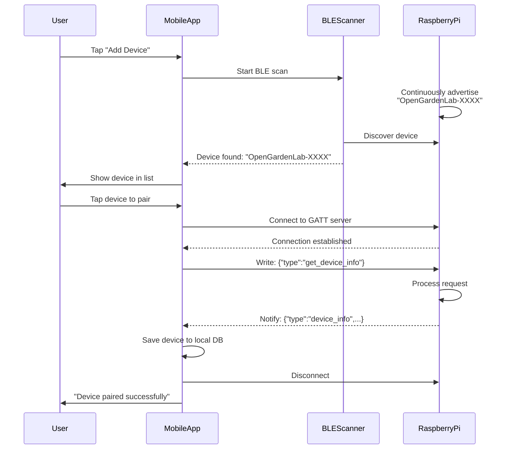
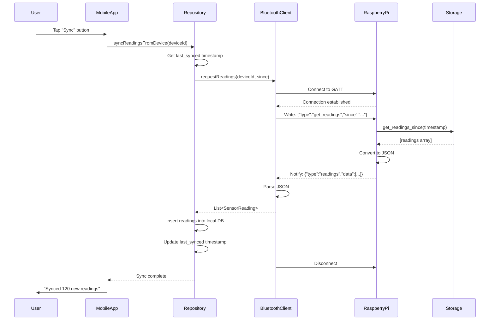
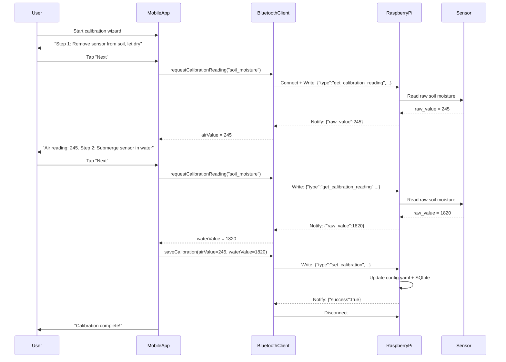

# Bluetooth Protocol & Integration

## Protocol Overview

OpenGardenLab uses **Bluetooth Low Energy (BLE)** for communication between the Raspberry Pi device and Android mobile app. The protocol is designed for:

- **Low power consumption** on the Pi (BLE vs classic Bluetooth)
- **Simple request/response pattern** (mobile app initiates, device responds)
- **JSON message format** for human readability and debuggability
- **Offline capability** (no internet required, device operates autonomously)

**Communication Pattern:** Client-Server
- **Server:** Raspberry Pi (BLE peripheral, always advertising)
- **Client:** Android mobile app (BLE central, connects on-demand)

**Connection Model:**
1. Pi advertises continuously as `OpenGardenLab-XXXX`
2. Mobile app scans, discovers device, connects
3. Mobile app sends JSON request via GATT write
4. Pi processes request, responds via GATT read/notification
5. Mobile app disconnects after data transfer complete

---

## BLE Service and Characteristic UUIDs

**Custom BLE Service for OpenGardenLab:**

```
Service UUID:  6e400001-b5a3-f393-e0a9-e50e24dcca9e  (OpenGardenLab Data Service)

Characteristics:
- TX Characteristic (Device → App):
  UUID: 6e400003-b5a3-f393-e0a9-e50e24dcca9e
  Properties: NOTIFY
  Purpose: Device sends responses to mobile app

- RX Characteristic (App → Device):
  UUID: 6e400002-b5a3-f393-e0a9-e50e24dcca9e
  Properties: WRITE
  Purpose: Mobile app sends requests to device
```

**UUID Choice Rationale:**
- Using Nordic UART Service (NUS) UUIDs for compatibility with existing BLE tools
- Well-tested UUID range, documented in nRF Connect and other BLE debuggers
- Can be changed to fully custom UUIDs if desired (generate via `uuidgen`)

**Advertising Data:**
- **Device Name:** `OpenGardenLab-XXXX` (XXXX = last 4 hex digits of Pi MAC address)
- **Service UUID:** `6e400001-b5a3-f393-e0a9-e50e24dcca9e` (advertised in scan response)
- **Tx Power Level:** 0 dBm (default, ~30-100 feet range)

---

## JSON Message Protocol

All messages exchanged between mobile app and device are **JSON strings** encoded as UTF-8.

### Request Messages (App → Device)

**1. Get Device Info**
```json
{
  "type": "get_device_info"
}
```

**Response:**
```json
{
  "type": "device_info",
  "device_id": "opengardenlab-a1b2c3d4",
  "firmware_version": "1.0.0",
  "storage_readings_count": 1234,
  "storage_size_mb": 12.5,
  "uptime_seconds": 86400
}
```

---

**2. Get Sensor Readings**
```json
{
  "type": "get_readings",
  "since": "2025-10-01T12:00:00Z"
}
```

**Response:**
```json
{
  "type": "readings",
  "data": [
    {
      "timestamp": "2025-10-02T14:00:00Z",
      "soil_moisture": 45.2,
      "soil_temp_stemma": 22.1,
      "soil_temp_ds18b20": 21.8,
      "light_lux": 12000,
      "air_temp": 23.5,
      "air_humidity": 55.2
    },
    {
      "timestamp": "2025-10-02T14:15:00Z",
      "soil_moisture": 44.8,
      "soil_temp_stemma": 22.3,
      "soil_temp_ds18b20": 22.0,
      "light_lux": 13500,
      "air_temp": 24.1,
      "air_humidity": 54.8
    }
    // ... additional readings
  ],
  "count": 120
}
```

**Large Payload Handling:**
- If response exceeds BLE MTU (~512 bytes), split into multiple notifications
- Mobile app reassembles chunks based on message framing
- Alternative: Compress JSON with gzip before transmission

---

**3. Update Configuration (Sampling Interval)**
```json
{
  "type": "set_config",
  "sampling_interval_minutes": 30
}
```

**Response:**
```json
{
  "type": "config_updated",
  "success": true,
  "message": "Sampling interval updated to 30 minutes"
}
```

---

**4. Get Calibration Reading (for wizard)**
```json
{
  "type": "get_calibration_reading",
  "sensor": "soil_moisture"
}
```

**Response:**
```json
{
  "type": "calibration_reading",
  "sensor": "soil_moisture",
  "raw_value": 245
}
```

---

**5. Save Calibration Values**
```json
{
  "type": "set_calibration",
  "sensor": "soil_moisture",
  "air_value": 245,
  "water_value": 1820
}
```

**Response:**
```json
{
  "type": "calibration_updated",
  "success": true,
  "message": "Soil moisture calibration saved"
}
```

---

**Error Response (for any failed request):**
```json
{
  "type": "error",
  "error_code": "INVALID_REQUEST",
  "message": "Unknown request type: get_xyz",
  "timestamp": "2025-10-02T14:30:00Z"
}
```

---

## BLE Communication Workflows

### Workflow 1: Device Discovery and Pairing



---

### Workflow 2: Data Sync



---

### Workflow 3: Calibration Wizard



---

## Firmware BLE Server Implementation

**Python (using bleak library):**

```python
import asyncio
import json
from bleak import BleakServer, BleakGATTCharacteristic
from storage import SensorDataStore
from config import load_config, save_config
from sensors.stemma_soil import STEMMASoilSensor
import logging

# BLE Service and Characteristic UUIDs
SERVICE_UUID = "6e400001-b5a3-f393-e0a9-e50e24dcca9e"
RX_CHAR_UUID = "6e400002-b5a3-f393-e0a9-e50e24dcca9e"  # Write (app → device)
TX_CHAR_UUID = "6e400003-b5a3-f393-e0a9-e50e24dcca9e"  # Notify (device → app)

class OpenGardenLabBLEServer:
    def __init__(self, storage: SensorDataStore, config: dict):
        self.storage = storage
        self.config = config
        self.logger = logging.getLogger(__name__)

    async def rx_handler(self, characteristic: BleakGATTCharacteristic, data: bytearray):
        """Handle incoming requests from mobile app"""
        try:
            request = json.loads(data.decode('utf-8'))
            self.logger.info(f"Received request: {request}")

            response = await self.process_request(request)
            response_json = json.dumps(response)

            # Send response via TX characteristic (notify)
            await characteristic.service.get_characteristic(TX_CHAR_UUID).notify(
                response_json.encode('utf-8')
            )

        except Exception as e:
            self.logger.error(f"Error handling request: {e}")
            error_response = {
                "type": "error",
                "error_code": "PROCESSING_ERROR",
                "message": str(e)
            }
            await characteristic.service.get_characteristic(TX_CHAR_UUID).notify(
                json.dumps(error_response).encode('utf-8')
            )

    async def process_request(self, request: dict) -> dict:
        """Process JSON request and return response"""
        req_type = request.get("type")

        if req_type == "get_device_info":
            return self.get_device_info()

        elif req_type == "get_readings":
            since = request.get("since", "1970-01-01T00:00:00Z")
            return self.get_readings(since)

        elif req_type == "set_config":
            interval = request.get("sampling_interval_minutes")
            return self.set_sampling_interval(interval)

        elif req_type == "get_calibration_reading":
            sensor = request.get("sensor")
            return self.get_calibration_reading(sensor)

        elif req_type == "set_calibration":
            return self.set_calibration(request)

        else:
            return {
                "type": "error",
                "error_code": "INVALID_REQUEST",
                "message": f"Unknown request type: {req_type}"
            }

    def get_device_info(self) -> dict:
        db_config = self.storage.get_config()
        return {
            "type": "device_info",
            "device_id": db_config['device_id'],
            "firmware_version": "1.0.0",
            "storage_readings_count": self.storage.get_readings_count(),
            "uptime_seconds": self.get_uptime()
        }

    def get_readings(self, since_timestamp: str) -> dict:
        readings = self.storage.get_readings_since(since_timestamp)
        return {
            "type": "readings",
            "data": readings,
            "count": len(readings)
        }

    def set_sampling_interval(self, interval_minutes: int) -> dict:
        self.storage.update_config(sampling_interval_minutes=interval_minutes)
        # Also update YAML config
        self.config['sampling_interval_minutes'] = interval_minutes
        save_config(self.config)
        return {
            "type": "config_updated",
            "success": True,
            "message": f"Sampling interval updated to {interval_minutes} minutes"
        }

    def get_calibration_reading(self, sensor: str) -> dict:
        if sensor == "soil_moisture":
            # Trigger immediate sensor read
            stemma = STEMMASoilSensor(I2C())
            raw_value = stemma.read_moisture_raw()
            return {
                "type": "calibration_reading",
                "sensor": sensor,
                "raw_value": raw_value
            }
        else:
            return {
                "type": "error",
                "error_code": "INVALID_SENSOR",
                "message": f"Unknown sensor: {sensor}"
            }

    def set_calibration(self, request: dict) -> dict:
        air_value = request.get("air_value")
        water_value = request.get("water_value")

        self.storage.update_config(
            soil_moisture_air_value=air_value,
            soil_moisture_water_value=water_value
        )

        # Update YAML config
        self.config['soil_moisture_calibration']['air_value'] = air_value
        self.config['soil_moisture_calibration']['water_value'] = water_value
        save_config(self.config)

        return {
            "type": "calibration_updated",
            "success": True,
            "message": "Soil moisture calibration saved"
        }

    async def run(self):
        """Start BLE server and advertise"""
        # Create BLE server with service and characteristics
        # (Full implementation requires bleak server setup)
        self.logger.info("BLE server started, advertising as OpenGardenLab-XXXX")
        # Await indefinitely
        await asyncio.Event().wait()
```

---

## Mobile App BLE Client Implementation

**Kotlin (Android BLE APIs):**

```kotlin
class BluetoothClientImpl(private val context: Context) : BluetoothClient {
    private val bluetoothManager = context.getSystemService(BluetoothManager::class.java)
    private val bluetoothAdapter = bluetoothManager.adapter

    companion object {
        val SERVICE_UUID = UUID.fromString("6e400001-b5a3-f393-e0a9-e50e24dcca9e")
        val RX_CHAR_UUID = UUID.fromString("6e400002-b5a3-f393-e0a9-e50e24dcca9e")
        val TX_CHAR_UUID = UUID.fromString("6e400003-b5a3-f393-e0a9-e50e24dcca9e")
    }

    override suspend fun scanForDevices(): List<BluetoothDevice> = withContext(Dispatchers.IO) {
        val devices = mutableListOf<BluetoothDevice>()
        val scanner = bluetoothAdapter.bluetoothLeScanner

        val scanCallback = object : ScanCallback() {
            override fun onScanResult(callbackType: Int, result: ScanResult) {
                if (result.device.name?.startsWith("OpenGardenLab") == true) {
                    devices.add(result.device)
                }
            }
        }

        val scanFilter = ScanFilter.Builder()
            .setServiceUuid(ParcelUuid(SERVICE_UUID))
            .build()

        scanner.startScan(listOf(scanFilter), ScanSettings.Builder().build(), scanCallback)
        delay(10000) // Scan for 10 seconds
        scanner.stopScan(scanCallback)

        devices
    }

    override suspend fun requestReadings(deviceId: String, sinceTimestamp: String): List<SensorReading> =
        withContext(Dispatchers.IO) {
            connectAndExecute(deviceId) { gatt, txChar, rxChar ->
                // Send request
                val request = JSONObject().apply {
                    put("type", "get_readings")
                    put("since", sinceTimestamp)
                }
                rxChar.value = request.toString().toByteArray()
                gatt.writeCharacteristic(rxChar)

                // Wait for response notification
                val response = waitForNotification(txChar)
                parseReadingsResponse(response)
            }
        }

    private suspend fun connectAndExecute(
        deviceId: String,
        block: suspend (BluetoothGatt, BluetoothGattCharacteristic, BluetoothGattCharacteristic) -> Unit
    ) {
        val device = bluetoothAdapter.getRemoteDevice(deviceId)
        val gatt = device.connectGatt(context, false, gattCallback)

        // Wait for connection, discover services, get characteristics
        val service = gatt.getService(SERVICE_UUID)
        val txChar = service.getCharacteristic(TX_CHAR_UUID)
        val rxChar = service.getCharacteristic(RX_CHAR_UUID)

        // Enable notifications on TX characteristic
        gatt.setCharacteristicNotification(txChar, true)

        // Execute operation
        block(gatt, txChar, rxChar)

        // Disconnect
        gatt.disconnect()
        gatt.close()
    }

    private fun parseReadingsResponse(json: String): List<SensorReading> {
        val jsonObject = JSONObject(json)
        val dataArray = jsonObject.getJSONArray("data")

        return (0 until dataArray.length()).map { i ->
            val reading = dataArray.getJSONObject(i)
            SensorReading(
                deviceId = "", // Will be set by repository
                timestamp = reading.getString("timestamp"),
                soilMoisture = reading.getDouble("soil_moisture"),
                soilTempStemma = reading.getDouble("soil_temp_stemma"),
                soilTempDs18b20 = reading.optDouble("soil_temp_ds18b20"),
                lightLux = reading.getDouble("light_lux"),
                airTemp = reading.getDouble("air_temp"),
                airHumidity = reading.getDouble("air_humidity")
            )
        }
    }
}
```

---

## Error Handling and Retry Logic

**Connection Failures:**
- Mobile app retries connection 3 times with exponential backoff (1s, 2s, 4s)
- If all retries fail, show user-friendly error: "Unable to connect to device. Make sure device is powered on and within range."

**Timeout Handling:**
- Requests timeout after 30 seconds (BLE MTU negotiation + data transfer)
- Large data syncs (30 days of readings) may take 2-5 minutes - show progress indicator

**Partial Data Loss:**
- If connection drops mid-sync, mobile app requests data from last successful timestamp
- No duplicate data inserted (use `INSERT OR IGNORE` based on timestamp + device_id)

**Device Offline:**
- If device is not advertising (powered off, out of range), scan returns empty list
- Mobile app shows "No devices found. Make sure device is powered on."

---

## Security Considerations

**MVP Security Model (Low Threat):**
- **No authentication required** - Single-user system, physical proximity required
- **No encryption** - BLE connection is local, sensor data is not sensitive
- **Pairing is implicit** - Any mobile app can connect to any OpenGardenLab device

**Rationale:**
- Threat model: Home garden (not public space), user owns both device and phone
- Attack scenarios unlikely: Would require attacker to be within BLE range (~30-100 feet) of your garden
- Sensor data is not sensitive (soil moisture, light, temperature)

**Post-MVP Security Enhancements (if needed):**
- **BLE Pairing/Bonding** - Use Just Works pairing for device authentication
- **Encrypted BLE connection** - Enable LE Secure Connections for data encryption
- **PIN-based pairing** - Display PIN on device (via LED blinks or debug output), enter in app

**For MVP, simplicity and ease of use outweigh security concerns.**

---

**Phase 5 Complete.** This section defined the complete Bluetooth protocol: BLE service/characteristic UUIDs, JSON message specifications, sequence diagrams for key workflows (discovery, sync, calibration), error handling, and security model.

---
