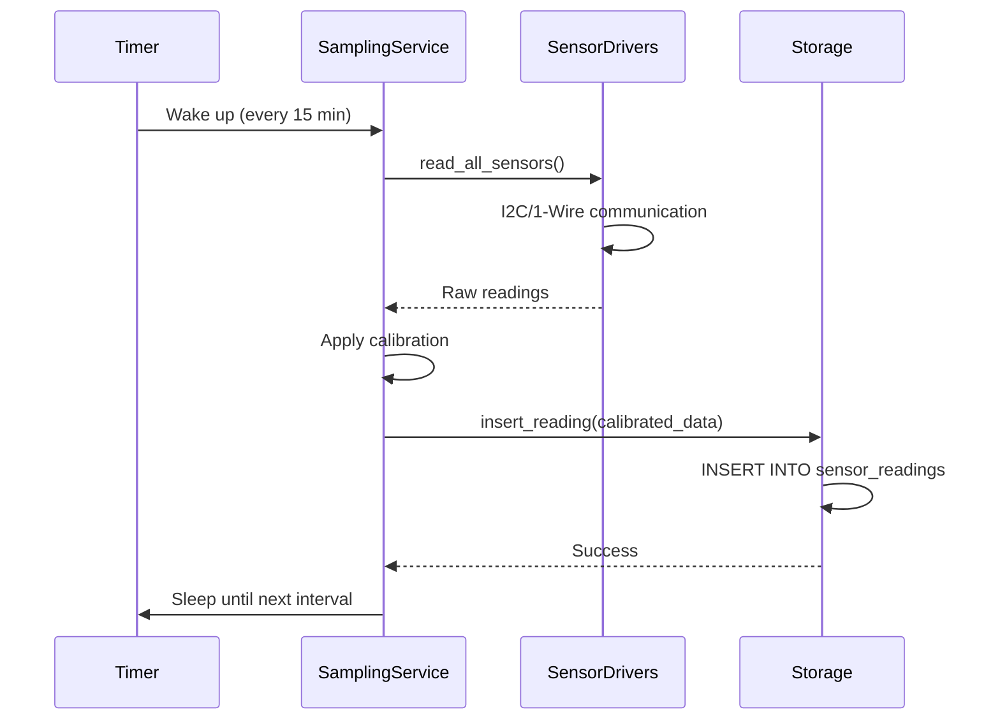

# Firmware Architecture (Raspberry Pi)

## Component Overview

The Raspberry Pi firmware is a **Python monolith** consisting of 5 major components that work together to sample sensors, store data, and sync with the mobile app via Bluetooth.

**Architecture Pattern:** Layered monolith with clear separation of concerns

```
┌─────────────────────────────────────────────────────┐
│           Bluetooth Server (BLE)                    │
│  Advertises device, handles sync requests           │
└─────────────────┬───────────────────────────────────┘
                  │ Queries data
                  ▼
┌─────────────────────────────────────────────────────┐
│           Storage Layer (SQLite)                    │
│  Insert readings, query by timestamp, config mgmt   │
└─────────────────┬───────────────────────────────────┘
                  │ Stores readings
                  ▼
┌─────────────────────────────────────────────────────┐
│           Sensor Sampling Service (Main Loop)       │
│  Orchestrates sensor reads, applies calibration     │
└───┬──────┬──────┬──────┬────────────────────────────┘
    │      │      │      │ Reads sensors
    ▼      ▼      ▼      ▼
┌────────┐┌────────┐┌────────┐┌────────┐
│ STEMMA ││ BH1750 ││ DHT20  ││DS18B20 │
│ Soil   ││ Light  ││Air T/H ││Soil T  │
└────────┘└────────┘└────────┘└────────┘
    Sensor Drivers (I2C/1-Wire)

          Configuration Manager
          (YAML config loader)
```

---

## Component 1: Sensor Drivers

**Purpose:** Low-level interface to physical sensors, abstracting I2C/1-Wire communication.

**Location:** `firmware/src/sensors/`

**Modules:**

### `stemma_soil.py`
```python
from adafruit_seesaw.seesaw import Seesaw
from board import I2C

class STEMMASoilSensor:
    """Adafruit STEMMA Soil Sensor (capacitive moisture + temp)"""

    def __init__(self, i2c_bus: I2C, address: int = 0x36):
        self.sensor = Seesaw(i2c_bus, addr=address)

    def read_moisture_raw(self) -> int:
        """Returns raw capacitance reading (200-2000 typical range)"""
        return self.sensor.moisture_read()

    def read_temperature(self) -> float:
        """Returns soil temperature in Celsius"""
        return self.sensor.get_temp()

    def calibrate_moisture(self, raw_value: int, air_value: int, water_value: int) -> float:
        """Converts raw reading to 0-100% using calibration values"""
        if water_value == air_value:
            return 0.0
        percentage = ((raw_value - air_value) / (water_value - air_value)) * 100
        return max(0.0, min(100.0, percentage))  # Clamp to 0-100%
```

**Interface:** `read_moisture_raw()`, `read_temperature()`, `calibrate_moisture()`

---

### `bh1750_light.py`
```python
from adafruit_bh1750 import BH1750
from board import I2C

class BH1750LightSensor:
    """BH1750 Digital Light Sensor (0-65535 lux)"""

    def __init__(self, i2c_bus: I2C, address: int = 0x23):
        self.sensor = BH1750(i2c_bus, address)

    def read_lux(self) -> float:
        """Returns light intensity in lux"""
        return self.sensor.lux
```

**Interface:** `read_lux()`

---

### `dht20_temp_humid.py`
```python
from adafruit_ahtx0 import AHTx0
from board import I2C

class DHT20Sensor:
    """DHT20/AHT20 Air Temperature and Humidity Sensor"""

    def __init__(self, i2c_bus: I2C, address: int = 0x38):
        self.sensor = AHTx0(i2c_bus, address)

    def read_temperature(self) -> float:
        """Returns air temperature in Celsius"""
        return self.sensor.temperature

    def read_humidity(self) -> float:
        """Returns relative humidity (0-100%)"""
        return self.sensor.relative_humidity
```

**Interface:** `read_temperature()`, `read_humidity()`

---

### `ds18b20_temp.py`
```python
from w1thermsensor import W1ThermSensor, Sensor

class DS18B20Sensor:
    """DS18B20 Waterproof Soil Temperature Probe (1-Wire)"""

    def __init__(self):
        try:
            self.sensor = W1ThermSensor(sensor_type=Sensor.DS18B20)
        except Exception as e:
            self.sensor = None  # Sensor not connected (optional sensor)

    def read_temperature(self) -> float | None:
        """Returns soil temperature in Celsius, or None if sensor missing"""
        if self.sensor is None:
            return None
        return self.sensor.get_temperature()
```

**Interface:** `read_temperature()` (returns `None` if sensor absent)

---

## Component 2: Storage Layer

**Purpose:** SQLite database abstraction for storing sensor readings and device configuration.

**Location:** `firmware/src/storage.py`

**Database Schema:**

```sql
-- Sensor readings table
CREATE TABLE IF NOT EXISTS sensor_readings (
    id INTEGER PRIMARY KEY AUTOINCREMENT,
    device_id TEXT NOT NULL,
    timestamp TEXT NOT NULL,  -- ISO 8601 UTC: '2025-10-02T14:30:00Z'
    soil_moisture REAL,       -- 0-100%
    soil_temp_stemma REAL,    -- °C
    soil_temp_ds18b20 REAL,   -- °C (nullable)
    light_lux REAL,           -- 0-65535
    air_temp REAL,            -- °C
    air_humidity REAL         -- 0-100%
);

CREATE INDEX IF NOT EXISTS idx_timestamp ON sensor_readings(timestamp);
CREATE INDEX IF NOT EXISTS idx_device_id ON sensor_readings(device_id);

-- Device configuration (single row, updated in place)
CREATE TABLE IF NOT EXISTS device_config (
    id INTEGER PRIMARY KEY CHECK (id = 1),  -- Enforce single row
    device_id TEXT NOT NULL,
    sampling_interval_minutes INTEGER DEFAULT 15,
    soil_moisture_air_value INTEGER DEFAULT 200,    -- Calibration
    soil_moisture_water_value INTEGER DEFAULT 2000  -- Calibration
);
```

**Python Module Interface:**

```python
import sqlite3
from datetime import datetime
from typing import List, Dict, Optional

class SensorDataStore:
    """SQLite storage layer for sensor readings and config"""

    def __init__(self, db_path: str = "firmware/data/sensor_data.db"):
        self.db_path = db_path
        self.conn = sqlite3.connect(db_path)
        self._create_tables()

    def insert_reading(self, device_id: str, soil_moisture: float,
                       soil_temp_stemma: float, soil_temp_ds18b20: Optional[float],
                       light_lux: float, air_temp: float, air_humidity: float):
        """Insert a new sensor reading with current timestamp"""
        timestamp = datetime.utcnow().isoformat() + 'Z'
        self.conn.execute("""
            INSERT INTO sensor_readings
            (device_id, timestamp, soil_moisture, soil_temp_stemma,
             soil_temp_ds18b20, light_lux, air_temp, air_humidity)
            VALUES (?, ?, ?, ?, ?, ?, ?, ?)
        """, (device_id, timestamp, soil_moisture, soil_temp_stemma,
              soil_temp_ds18b20, light_lux, air_temp, air_humidity))
        self.conn.commit()

    def get_readings_since(self, since_timestamp: str) -> List[Dict]:
        """Query all readings since a given ISO timestamp"""
        cursor = self.conn.execute("""
            SELECT * FROM sensor_readings
            WHERE timestamp > ?
            ORDER BY timestamp ASC
        """, (since_timestamp,))
        columns = [desc[0] for desc in cursor.description]
        return [dict(zip(columns, row)) for row in cursor.fetchall()]

    def get_latest_reading(self) -> Dict:
        """Get most recent sensor reading"""
        cursor = self.conn.execute("""
            SELECT * FROM sensor_readings
            ORDER BY timestamp DESC LIMIT 1
        """)
        columns = [desc[0] for desc in cursor.description]
        row = cursor.fetchone()
        return dict(zip(columns, row)) if row else {}

    def get_config(self) -> Dict:
        """Retrieve device configuration"""
        cursor = self.conn.execute("SELECT * FROM device_config WHERE id = 1")
        row = cursor.fetchone()
        if not row:
            return self._create_default_config()
        columns = [desc[0] for desc in cursor.description]
        return dict(zip(columns, row))

    def update_config(self, **kwargs):
        """Update device configuration (sampling interval, calibration, etc.)"""
        # Build UPDATE query dynamically based on kwargs
        set_clause = ", ".join([f"{k} = ?" for k in kwargs.keys()])
        values = list(kwargs.values())
        self.conn.execute(f"UPDATE device_config SET {set_clause} WHERE id = 1", values)
        self.conn.commit()
```

**Key Operations:**
- `insert_reading()` - Store new sensor reading
- `get_readings_since(timestamp)` - Fetch readings for Bluetooth sync
- `get_latest_reading()` - For health checks/debugging
- `get_config()` / `update_config()` - Manage calibration and settings

---

## Component 3: Sensor Sampling Service

**Purpose:** Main application loop that orchestrates sensor reading, calibration, and storage every N minutes.

**Location:** `firmware/src/sensor_service.py`

**Architecture:**

```python
import time
import logging
from board import I2C
from sensors.stemma_soil import STEMMASoilSensor
from sensors.bh1750_light import BH1750LightSensor
from sensors.dht20_temp_humid import DHT20Sensor
from sensors.ds18b20_temp import DS18B20Sensor
from storage import SensorDataStore
from config import load_config

class SensorSamplingService:
    """Main service: reads sensors every N minutes, stores to DB"""

    def __init__(self):
        self.config = load_config("firmware/config.yaml")
        self.device_id = self.config['device_id']
        self.sampling_interval = self.config['sampling_interval_minutes'] * 60  # Convert to seconds

        # Initialize I2C bus and sensors
        i2c = I2C()
        self.stemma = STEMMASoilSensor(i2c)
        self.bh1750 = BH1750LightSensor(i2c)
        self.dht20 = DHT20Sensor(i2c)
        self.ds18b20 = DS18B20Sensor()  # 1-Wire

        # Initialize storage
        self.storage = SensorDataStore()

        # Logging setup
        logging.basicConfig(
            level=logging.INFO,
            format='%(asctime)s - %(levelname)s - %(message)s',
            handlers=[
                logging.FileHandler('firmware/logs/sensor_service.log'),
                logging.StreamHandler()
            ]
        )
        self.logger = logging.getLogger(__name__)

    def read_all_sensors(self) -> dict:
        """Read all sensors and apply calibration"""
        try:
            # Read raw soil moisture
            moisture_raw = self.stemma.read_moisture_raw()

            # Apply calibration from config
            db_config = self.storage.get_config()
            soil_moisture = self.stemma.calibrate_moisture(
                moisture_raw,
                db_config['soil_moisture_air_value'],
                db_config['soil_moisture_water_value']
            )

            # Read all other sensors
            readings = {
                'soil_moisture': soil_moisture,
                'soil_temp_stemma': self.stemma.read_temperature(),
                'soil_temp_ds18b20': self.ds18b20.read_temperature(),  # May be None
                'light_lux': self.bh1750.read_lux(),
                'air_temp': self.dht20.read_temperature(),
                'air_humidity': self.dht20.read_humidity()
            }

            self.logger.info(f"Sensor readings: {readings}")
            return readings

        except Exception as e:
            self.logger.error(f"Sensor read error: {e}")
            return None

    def run(self):
        """Main loop: sample sensors every N minutes"""
        self.logger.info(f"Sensor service started (interval: {self.sampling_interval}s)")

        while True:
            readings = self.read_all_sensors()

            if readings:
                self.storage.insert_reading(
                    device_id=self.device_id,
                    soil_moisture=readings['soil_moisture'],
                    soil_temp_stemma=readings['soil_temp_stemma'],
                    soil_temp_ds18b20=readings['soil_temp_ds18b20'],
                    light_lux=readings['light_lux'],
                    air_temp=readings['air_temp'],
                    air_humidity=readings['air_humidity']
                )
                self.logger.info("Reading stored to database")

            time.sleep(self.sampling_interval)

if __name__ == "__main__":
    service = SensorSamplingService()
    service.run()
```

**Workflow:**
1. Load config (sampling interval, calibration values)
2. Initialize I2C bus and all sensors
3. Loop:
   - Read all sensors
   - Apply soil moisture calibration
   - Store reading to SQLite
   - Sleep for N minutes
   - Repeat

**Error Handling:** Logs errors but continues loop (one bad reading doesn't crash service)

---

## Component 4: Configuration Manager

**Purpose:** Load and manage device configuration from YAML file.

**Location:** `firmware/src/config.py`

**Configuration File (`firmware/config.yaml`):**

```yaml
device_id: "opengardenlab-abc123"  # MAC address or UUID
sampling_interval_minutes: 15
soil_moisture_calibration:
  air_value: 200       # Raw value in air (0% moisture)
  water_value: 2000    # Raw value in water (100% moisture)
```

**Python Module:**

```python
import yaml
from typing import Dict

def load_config(config_path: str = "firmware/config.yaml") -> Dict:
    """Load YAML configuration file"""
    with open(config_path, 'r') as f:
        config = yaml.safe_load(f)
    return config

def save_config(config: Dict, config_path: str = "firmware/config.yaml"):
    """Save configuration to YAML (for Bluetooth config updates)"""
    with open(config_path, 'w') as f:
        yaml.dump(config, f, default_flow_style=False)
```

**Configuration is dual-storage:**
- **YAML file** - Human-editable via SSH, loaded at startup
- **SQLite `device_config` table** - Runtime config, updated by Bluetooth commands

On startup, YAML config is written to SQLite. Runtime updates via Bluetooth update both YAML and SQLite.

---

## Component 5: Bluetooth BLE Server

**Purpose:** Advertise device via Bluetooth Low Energy, handle mobile app sync requests.

**Location:** `firmware/src/bluetooth_server.py`

**Architecture:** Async BLE server using `bleak` library (details in Phase 5: Bluetooth Protocol)

**Key Responsibilities:**
- Advertise as `OpenGardenLab-XXXX` (XXXX = last 4 of MAC)
- Accept BLE connections from mobile app
- Handle JSON protocol requests:
  - `get_device_info` → Return device ID, firmware version, storage stats
  - `get_readings` → Query storage layer, return sensor data since timestamp
  - `set_config` → Update sampling interval, calibration values
  - `get_calibration_reading` → Trigger on-demand sensor read (for calibration wizard)

**Runs concurrently** with sensor sampling service (multi-threaded or separate systemd service)

---

## Firmware Data Flow

**Sensor Sampling Workflow:**



**Bluetooth Sync Workflow** (detailed in Phase 5)

---

**Phase 3 Complete.** This section defined the complete firmware architecture: 5 components (sensor drivers, storage, sampling service, config manager, BLE server), Python module structure, database schema, and sensor sampling workflow.

---
